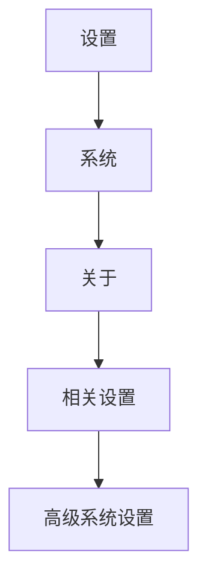

> 自建NPM仓库 [A lightweight Node.js private proxy registry | Verdaccio](https://verdaccio.org/zh-CN/)

# 搭建私有NPM库

## 什么是 Verdaccio？

Verdaccio 是一个 **Node.js**创建的**轻量的私有npm proxy registry**

## 安装

### 最低配置要求

1. NodeJs版本最低是 `v12`

2. 使用最新的Node包管理工具，最低要求如下

   > <npm@6.x>

   <yarn@1.x>
   <yarn@2.x>
   <pnpm@6.x>

### 开始安装

```shell
npm install --location=global verdaccio
```

或者

```shell
yarn global add verdaccio
```

或者

```shell
pnpm install -g verdaccio
```

![[Pasted image 20221228164450.png]]

> [!tip] 需要配置一下全局路径


### 配置环境变量



![[Pasted image 20221228170139.png]]

> 点击`环境变量`

![[Pasted image 20221228170220.png]]

> 选中`Path`，然后点击`编辑`

![[Pasted image 20221228170333.png]]

> 在变量值的末尾添加上`;C:\Users\11834\AppData\Local\Yarn\Data\global\node_modules\.bin`
>
> 这个路径是我Yarn全局安装后程序的路径

![[Pasted image 20221228170450.png]]

> 一路确定，就行了

## 运行verdaccio

命令行运行下面的命令

```shell
verdaccio
```

> [!tip] 正常情况
> 正常情况下，是不会有什么问题的


![[Pasted image 20221228171005.png]]

> [!tip] 遇到异常
> 但是遇到了下面这个情况的话


![[Pasted image 20221228170948.png]]

> [!tip] 修改 verdaccio 配置文件
> 那就进入配置文件 (`C:\Users\11834\AppData\Roaming\verdaccio\config.yaml`) 中修改监听的端口号, 在第 150 行处进行修改
> 配置文件的具体描述: [Site Unreachable](https://verdaccio.org/zh-cn/docs/configuration/)


```diff
- # listen:
- # - localhost:4873            # default value
+ listen:
+ - localhost:999            # default value
```

## 搭建完成

进入NPM私有库网站`http://localhost:999/`

> [!tip] 我这里是修改了端口号的

![[Pasted image 20221228171540.png]]


## 使用私有库

```shell
npm config set registry=http://localhost:999
```

或者

```shell
yarn config set registry http://localhost:999
```

![[Pasted image 20221228171916.png]]


# 上传NPM包到私有NPM库

## [第一次发布包] 创建私有库账号

> [!info] 注意
如果上面[[#使用私有库|使用私有库]]这一步和你接下来使用的工具为同一种工具的话，那么就可以不用添加`--registry http://localhost:999`

```shell
npm adduser --registry http://localhost:999
```

![[Pasted image 20221228172630.png]]

## [不是第一次发布包] 登录私有库账号

```shell
npm login --registry http://localhost:999
```

![[Pasted image 20221228174029.png]]

## 上传库

> [!tip] 进入想要发布的NPM包的路径下面，然后运行`npm publish`，就可以了


![[Pasted image 20221228173336.png]]

> [!tip] 然后登入网络查看，添加NPM包情况

![[Pasted image 20221228174126.png]]