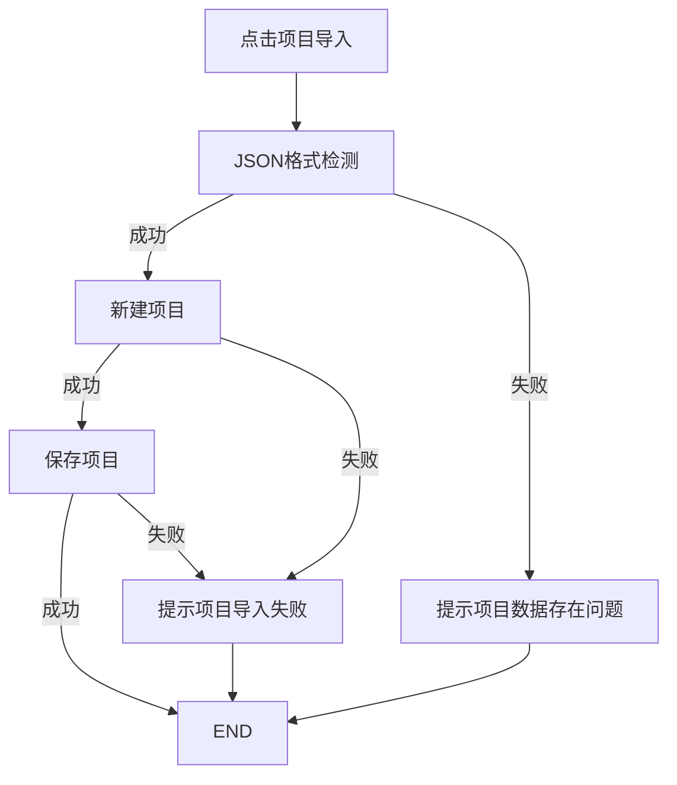
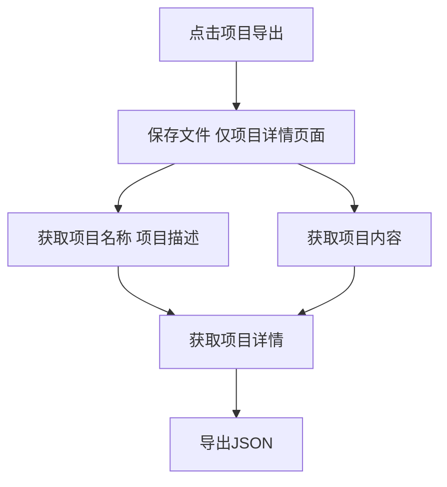

## 功能分布

1. 项目管理页面 项目卡片，添加项目导出功能
2. 项目详情页面 添加项目导出功能
3. 项目管理页面 Header 添加项目导入功能

## 项目导入功能点



>[!NOTE] 添加提示
>1. 当**新建项目**成功&&**保存项目**失败时，提示"项目导入失败"，但是不用回退，也不用删除新建成功的项目
>2. 当**新建项目**失败，提示"项目导入失败"

## 项目导出功能点




> [!INFO]- ~~功能点实现步骤~~
> 1. ~~使用`iojson`进行导出~~  使用`iojson-ts`进行导出
>~~~ react
>  import {exportJSON, importJSON} from "iojson-ts"
>~~~
> 2. 通过`/projects/${projectID}`获取项目详情
> 3. 删除不必要的部分`id`、`username`、`updated`
> 4. 导出即可

>[!TIP] 自己封一个

>[!TIP] 提示信息同上
>但是在==项目详情页面==需要多一步操作： 保存项目(无需提示?)
>> 目前为 直接保存 --> 保存成功提示，保存失败提示


>[!TIP] 注意：当前功能需要做成钩子，以便复用

## 数据结构梳理

>[!TIP] 直接获取项目内容

```json 
{
	"id": 2,
	"name": "未命名项目2",
	"username": "siot",
	"description": "描述...",
	"cover": "",
	"content": "{\"components\":[],\"layouts\":{\"1\":{\"width\":1920,\"height\":1080,\"top\":0,\"left\":0,\"positions\":{}}},\"theme\":\"light\",\"iotPlatformSetting\":{\"url\":\"127.0.0.1\",\"username\":\"siot\",\"password\":\"dfrobot\",\"platform\":\"siot\"}}",
	"updated": 1666945395,
	"deployment": ""
}
```

>[!TIP]- 删除`id`、`username`、`updated`
>`updated`在导入时自动生成 -- 秒级
>~~~javascript
>new Date().getTime() / 1000
>~~~
>还是采用创建成功时出现的`updated`吧

```json 
{
	"name": "未命名项目2",
	"description": "描述...",
	"cover": "",
	"content": "{\"components\":[],\"layouts\":{\"1\":{\"width\":1920,\"height\":1080,\"top\":0,\"left\":0,\"positions\":{}}},\"theme\":\"light\",\"iotPlatformSetting\":{\"url\":\"127.0.0.1\",\"username\":\"siot\",\"password\":\"dfrobot\",\"platform\":\"siot\"}}",
	"deployment": ""
}
```