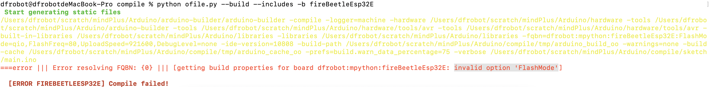

# Mac系统适配

## 前期准备

### PULL库

```shell
# MindPlus
git pull origin V1.7.2-RC3.0
# Arduino
git pull origin V1.7.2
# compat
git pull origin mac
```

### 编译SDK

> 大体上于其他的一样
> 
> ps: 1 2 3 4 5 6 7 8 10

#### 特殊: telloesp32

##### SETP1: 先屏蔽DFRobot_PlayerMini

> 路径: **Arduino\libraries\DFRobot_PlayerMini\config.json**

```diff
{
    "uno": true,
    "nano": true,
    "mpython": true,
-    "telloesp32": true,
+    "telloesp32": false,
    "microbit": true,
    "microbitV2": true,
    "leonardo": true,
    "mega2560": true,
    "beetleProMini": false,
    "fireBeetleEsp32":true,
    "include": "DFRobot_PlayerMini.h"
}
```

##### SETP2: 编译telloesp32

```shell
python ofile.py --build --includes -b telloesp32
```

##### SETP3: 解除屏蔽

```diff
{
    "uno": true,
    "nano": true,
    "mpython": true,
-    "telloesp32": false,
+    "telloesp32": true,
    "microbit": true,
    "microbitV2": true,
    "leonardo": true,
    "mega2560": true,
    "beetleProMini": false,
    "fireBeetleEsp32":true,
    "include": "DFRobot_PlayerMini.h"
}
```

##### SETP4: 单独编译DFRobot_PlayerMini

```shell
python ofile.py --build --includes -b telloesp32 -i DFRobot_PlayerMini.h
```

#### [已解决] 暂时存在问题的是 <u>fireBeetleEsp32E</u>



```shell
python ofile.py --build --includes -b fireBeetleEsp32E
```

> 在ofile.py文件中编译fireBeetleEsp32E的命令里面删除”FlashMode“参数后，编译成功

PS: 最后记得在编译完成后，在static文件夹创建分支并上传至Gitee

### 编译程序

#### SETP1: 编译翻译

```shell
# otherModules\scratch-l10n
yarn build
```

#### SETP2: 适配Compat

```shell
# mindplus
python build.py
```

#### SETP3: 编译VM

```shell
# mindplus
python buildvm.py
```

### 完整测试

#### 上传模式

| 主板(模式)               | 问题                                                                                                                | 备注                      |
| -------------------- | ----------------------------------------------------------------------------------------------------------------- | ----------------------- |
| 掌控(AC)               | [getting build properties for board dfrobot:mpython:mpython: invalid value '1500000' for option 'UploadSpeed']    | 用户库编译失败(代码于Window对比无差异) |
| telloesp32(AC)       | [getting build properties for board dfrobot:mpython:telloesp32: invalid value '1500000' for option 'UploadSpeed'] |                         |
| fireBeetleEsp32E(AC) | [getting build properties for board dfrobot:mpython:telloesp32: invalid value '750000' for option 'UploadSpeed']  |                         |

##### 解决fireBeetleEsp32E的问题

```diff
-        if ((this.name === "firebeetleesp32" || this.name === "fireBeetleEsp32E") && DEF_MAC) {
+        if (this.name === "firebeetleesp32" && DEF_MAC) {
             this.baudrate = 750000;
         }
-        if (this.name === "fireBeetleEsp32E" && DEF_WIN) {
+        // MAC: V1.7.2RC3.0 尝试和Window一样
+        if (this.name === "fireBeetleEsp32E" && (DEF_WIN || DEF_MAC)) {
             this.baudrate = 921600;
         }
         if (this.name === "esp32") {
class Esp32Burner extends CompileBase {
         } else if (this.name === "firebeetleesp32") {
             this.generatePrepare = `-fqbn=dfrobot:mpython:fireBeetleEsp32:FlashMode=dio,FlashFreq=80,UploadSpeed=${this.baudrate},DebugLevel=none`;
         } else if (this.name === "fireBeetleEsp32E") {
-            this.generatePrepare = `-fqbn=dfrobot:mpython:fireBeetleEsp32E:FlashMode=dio,FlashFreq=80,UploadSpeed=${this.baudrate},DebugLevel=none`;
+            // MAC: V1.7.2RC3.0 删除 FlashMode=dio,
+            this.generatePrepare = `-fqbn=dfrobot:mpython:fireBeetleEsp32E:FlashFreq=80,UploadSpeed=${this.baudrate},DebugLevel=none`;
```

##### 解决telloesp32的问题

```diff
+        if (this.name === "telloesp32" && DEF_MAC) {
+            this.baudrate = 921600;
+        }
```

##### 解决掌控(esp32)的问题

```diff
-        if (this.name === "telloesp32" && DEF_MAC) {
+        if ((this.name === "telloesp32" || this.name === "fireBeetleEsp32E" ) && DEF_MAC) {
             this.baudrate = 921600;
         }
```

#### 实时模式

leonardo 存在不稳定性

#### Python模式

> 1.7.2RC3.0需要自己下载行空板的资源 用于离线更新行空板的PinPong库
> 
> https://download3.dfrobot.com.cn/MindPlus/Python/resource/ssh/unihiker/pinpong-0.4.9-py3-none-any.whl
> 
> 保存位置: mindPlus\resources\static\pip\ssh\unihiker\

由于V1.7.1RC1.0与V1.7.2RC3.在Python模式上存在较大差异，所以要改的比较多

```
src\lib\python\operate.js
build\static\child_worker\python-env\python-env.js
src\components\python\xterm-wrapper\xterm-wrapper.jsx
compat\setup.py
```

> 都要修改

### 制作绿色包

#### 疑难①: 下载unihiker时，下载pyaudio失败

STEP1： 安装portaudio

> 因为portaudio是实现语音功能的框架，所以
> 
> 在终端中输入

```shell
brew install portaudio
```

STEP2: 安装pyaudio

```
pip install pyaudio
./python3.6 -m pip install pyaudio
```

> 这时再重新下载unihiker，就可以完成unihiker的下载了

## 适配

### 1. Python环境包释放逻辑

> 原本为: Python 不打包，直接以文件夹的形式进行释放
> 
> > 但是到了172RC3.0的时候，添加了一个《Python环境清理》的功能
> 
> 所以原释放逻辑改为新的释放逻辑: Python包**Python3.6.5.zip**，新增的Python库包**Lib.zip**

build\static\child_worker\python-env\python-env.js

```diff
  if (navigator.appVersion.match(/win/i)) {
      this.setPythonVersionWithBit();
-  } else if(navigator.appVersion.match(/linux/i)){
+  } else{
-      this.python = path.resolve(os.homedir(), `./Documents/mindplus-py/environment/Python3.6.5-${this.versionBit}/bin/python`);
+     this.python = path.resolve(os.homedir(), `./Documents/mindplus-py/environment/Python3.6.5-${this.versionBit}/bin/${navigator.appVersion.match(/mac/i)?'python3':'python'}`);
      this.pip = path.resolve(os.homedir(), `./Documents/mindplus-py/environment/Python3.6.5-${this.versionBit}/bin/pip`);
  }
```

> 记得最后还要 `npm run build`

build\static\child_worker\python-env\package.json

```diff
  "scripts": {
    "build": "npm run clean && webpack --progress --colors --bail",
-   "clean": "rm ./dist -rf && mkdir dist"
+   "clean": "rm -rf ./dist && mkdir dist"
  },
```

src\components\python\xterm-wrapper\xterm-wrapper.jsx

```diff
-  if (!DEF_MAC) {
-      this.startEnvActionWorker();
-  } else {
-      this.startPythonInterpreter(true);
-  }
+  this.startEnvActionWorker();
```

src\lib\python\operate.js

```diff
   if (DEF_WIN) {
       this.setPythonVersionWithBit();
-  } else if (DEF_LINUX) {
-      this.python = path.resolve(os.homedir(), `./Documents/mindplus-py/environment/Python3.6.5-${this.versionBit}/bin/python`);
-      this.pip = path.resolve(os.homedir(), `./Documents/mindplus-py/environment/Python3.6.5-${this.versionBit}/bin/pip`);
   } else {
-      this.python = path.resolve(getWorkPath(), `python/bin/python3.6`);
-      this.pip = path.resolve(getWorkPath(), `python/bin/pip3.6`);
+      this.python = path.resolve(os.homedir(), `./Documents/mindplus-py/environment/Python3.6.5-${this.versionBit}/bin/${DEF_MAC ? 'python3' : 'python'}`);
+      this.pip = path.resolve(os.homedir(), `./Documents/mindplus-py/environment/Python3.6.5-${this.versionBit}/bin/pip`);
   }
```

```diff
- let ext_path = path.resolve(this.python, DEF_WIN ? "../.pth" : "../../lib/python3.6/site-packages/.pth");
+ let ext_path = path.resolve(this.python, (DEF_WIN || DEF_MAC) ? "../.pth" : "../../lib/python3.6/site-packages/.pth");
- if (DEF_MAC) {
-     ext_path = path.resolve(os.homedir(), 'Documents/mindplus-py/site-packages/.pth')
- }
```

> （**.pth**）这里可能有些问题

### 2. 串口刷新

1. 串口名称刷新
   1. 原: 切换主板后，如果串口地址和之前串口地址一样，那么之前连接串口名称，不用二次连接，但是主板信息判断也不会变
   2. 现: 切换主板后，重新刷新原串口信息

[BUG #5972 上传模式--串口功能，AC分别连接microbit V1和V2,连接设备处未正确识别板子型号 - MindPlus - 禅道](http://test.dfrobot.top:5000/zentao/bug-view-5972.html)

[BUG #5986 AC--microbit 切换主板后二次烧录程序失败 - MindPlus - 禅道](http://test.dfrobot.top:5000/zentao/bug-view-5986.html)

2. 串口识别

src/components/select-serial/select-serial.jsx

```diff
  deviceList.map(item => {
      if (chooseSerial === item.value) { // 当前连接的串口，提到最前面
          allSerial.unshift(item);
          hasSerial = true;
      } else if (this.props.activeInterface === 1 && this.props.language === LanguageCpp && this.rememberSerial.value === item.value && !chooseSerial) {
          // 在上传模式页面，重新加载的串口
          reloadSerial = true;
+         this.rememberSerial = {...this.rememberSerial, ...item}
          allSerial.push(item);
      } else {
          allSerial.push(item);
      }
  })
```

> 337

```diff
- if (serialNumber.indexOf('9904') === 0) {
+ if (serialNumber.indexOf('9904') === 0 || serialNumber.indexOf('9905') === 0 || serialNumber.indexOf('9906') === 0) {
      name = 'Microbit V2';
  } else {
      name = 'Microbit';
  }
```

> 420

```diff
- if (port.serialNumber.indexOf('9904') === 0) {
+ if (port.serialNumber.indexOf('9904') === 0 || port.serialNumber.indexOf('9905') === 0 || port.serialNumber.indexOf('9906') === 0) {
      name = 'Microbit V2';
  } else {
      name = 'Microbit';
  }
```

### 3. 修改示例程序`测量温度DHT11.sb3`

[BUG #5973 实时模式--UNO，加载示例程序DHT11测量温度，读数失败 - MindPlus - 禅道](http://test.dfrobot.top:5000/zentao/bug-view-5973.html)

原因: 示例程序中的积木和现在版本的积木存在不同

### 4. 打开网络中心

[BUG #5980 python-pyboard，【连接远程终端】菜单，打开网络中心失败 - MindPlus - 禅道](http://test.dfrobot.top:5000/zentao/bug-view-5980.html)

resources/openNexxxWork.applescript

```applescript
tell application "System Preferences"
    activate
    if exists window "System Preferences" then
        tell window "System Preferences" to if it is miniaturized then set miniaturized to false
    else
        set current pane to pane "com.apple.preference.network"
    end if
end tell
```

src/components/connect-device/connect-device.jsx

```diff
  } else if (e.key == 'openNetNetWorkr') {
      if (DEF_WIN) {
          return childProcess.exec("ncpa.cpl");
      }
+     if (DEF_MAC) {
+         applescript.execFile(path.resolve("./resources/openNetNetWorkr.applescript"), (err, rtn) => {
+             if (err) {
+                 console.log("MAC.OpenNetNetWorkr.err====", err);
+             }
+         });
+     }
```

package.json

```diff
  "dependencies": {
       ....
+     "applescript": "^1.0.0",
  },
  "devDependencies": {
       ....
-     "electron-builder": "^22.1.0",
+     "electron-builder": "^23.1.0",
  }
```

### 5. 适配Python3

> 只有Python3没有Python

[BUG #5977 AC--三方库，编译掌控，用户库block报错 - MindPlus - 禅道](http://test.dfrobot.top:5000/zentao/bug-view-5977.html)

otherModules/scratch-vm/src/product/burner/compileBase.js

```diff
  if (DEF_MAC) {
-     this.python = 'python'
+     this.python = path.resolve(os.homedir(), `./Documents/mindplus-py/environment/Python3.6.5-64/  bin/python3`);
+     try {
+         this.runtime.childProcess.execSync(`${this.python} -h`)
+     }catch (e){
+         console.log(`调用 ${this.python} 失败==\n${e}`)
+         // 使用系统Python
+         this.python = 'python'
+         try{
+             this.runtime.childProcess.execSync(`${this.python} -h`)
+         }catch (e) {
+             console.log(`调用 ${this.python} 失败==\n${e}`)
+             this.python = 'python3'
+         }
+     }
+ 
+     // this.runtime.childProcess.exec(`which ${this.python}`,(e,_a,_b)=>{
+     //     if(e){
+     //         console.log(`${this.python}路径.error===`,e)
+     //     }
+     //     console.log(`${this.python}路径.stdin===`,_a)
+     //     console.log(`${this.python}路径.stderr===`,_b)
+     // })
  }
```

### 6. 字符型输入框加引号

[BUG #5979 主界面--其他，MPY下，字符型输入框自动加引号提示 - MindPlus - 禅道](http://test.dfrobot.top:5000/zentao/bug-view-5979.html)

otherModules/scratch-vm/src/blocks/board/scratch3_telloEsp32.js

```diff
  TEXT: {
      type: ArgumentType.STRING,
      defaultValue: "HELLO",
      inputParams: {
+         isQuote: { [LanguageMicropython]: true, [LanguageCpp]: true },
          validate: this._validateAny
      },
      dfCheck: { [LanguageCpp]: DataType.STRING }
  },
```

src/lib/block-generator/MicroPython/board/telloesp32.js

```diff
  telloesp32_matrixDisplayRollText(block, parameter) {
      this.addImport('from machine import *');
      this.addImport('from RMTTLib import *');
      this.addDeclaration(`i2c`, [
          `i2c = I2C(0, scl=Pin(26), sda=Pin(27), freq=400000)`,
      ], true);
      this.addDeclaration(`matrix`, [
          `matrix = RMTTMledCtrl(i2c)`,
      ], true);
      let direct = parameter.DIRECT.code;
      let speed = parameter.SPEED.code;
      let text = parameter.TEXT.code;
      let color = parameter.COLOR.code;
-     if(parameter.TEXT.parType === "text"){
-         text = `'${text}'`;
-     }else{
-         text = text;
-     }
      this.addCode(`matrix.start()`);
      this.addCode(`matrix.moveable_char('${direct}', ${speed} ,${text}, '${color}')`);
  }
```

### 7. 修改resources适配路径

src/lib/workPath.js

```diff
+ const getWorkResPath = () => {
+     if(DEF_MAC && !process.execPath.match(/node_modules\/electron\/dist/)){
+         return path.resolve(workPath, "res")
+     }
+     return path.resolve(workPath, "resources");
+ }

  export {
      setWorkPath,
      getWorkPath,
+     getWorkResPath
  }
```

src/components/connect-device/connect-device.jsx

```diff
  } else if (e.key == 'openNetNetWorkr') {
      if (DEF_WIN) {
          return childProcess.exec("ncpa.cpl");
      }
      if (DEF_MAC) {
-         applescript.execFile(path.resolve("./resources/openNetNetWorkr.applescript"), (err, rtn) => {
+         applescript.execFile(path.resolve(getWorkResPath(), "./openNetNetWorkr.applescript"), (err, rtn) => {
              if (err) {
                  console.log("MAC.OpenNetNetWorkr.err====", err);
              }
          });
      }
```

src/lib/python/ssh-manage/pip-updateversion-list.js

```diff
+ import { getWorkResPath } from "../../workPath"

  // 上传至远程的增量更新资源
- const innerLibLinux = path.join(workPath1, "./resources/static/pip/remote-ssh/");
+ const innerLibLinux = path.join(getWorkResPath(), "./static/pip/remote-ssh/");
```

src/lib/python/code-complete/complete.js

```diff
  getInstance = () => {
      // 'C:\\Users\\yjy\\AppData\\Local\\Programs\\Python\\Python37\\python.exe'
      if (typeof this.python !== 'string') return console.log('this.python====', this.python);
      this.codeServerInstance = ChildProcess.spawn(
          this.python, 
-         [path.join(getWorkPath(), "./resources/static/python/code-complete-server.py")],
+         [path.join(getWorkResPath(), "./static/python/code-complete-server.py")],
          { windowsHide: !0 });
      this.codeServerInstance.on("close", error => {
          this.codeServerInstance = null;
          if(error !== 0) console.log("Completer unexpected exit !", error);
      });
  }
```

### 8. 兼容

> compat/setup.py

> 6

```diff
+ def createListPath(path):
+     pathList = path.split("/")
+     dirPath = None
+     for i in pathList:
+         if i is None or i == "": continue
+         if dirPath is None:
+             dirPath = i
+         else:
+             dirPath = f"{dirPath}/{i}"
+         print("creat -->", dirPath)
+         if not os.path.exists(dirPath): os.mkdir(dirPath)

+ def set2export(data, jsonPath):
+     for key, value in data["scripts"].items():
+         data["scripts"][key] = value.replace("set ","export ")
+ 
+     string = json.dumps(data, indent=2, sort_keys=True)
+     with open(jsonPath, 'w') as f:
+         f.write(string)

+ def getData(jsonPath):
+     with open(jsonPath, 'r') as f:
+         return json.load(f)
```

> 49

```diff
+ print("rm resources")
+ os.system("rm -rf ./resources")
```

>57

```diff
+ print("download python3.6.5")
+ if not os.path.exists("./compat/Python3.6.5.zip"): os.system("wget -O ./compat/Python3.6.5.zip https://download3.dfrobot.com.cn/MindPlus/Python/resource/Python3.6.5_mac.zip")

+ print("download && copy remote-ssh")
+ createListPath("./compat/python/ssh/unihiker/")
+ createListPath("./resources/static/pip/remote-ssh/unihiker/")
+ if not os.path.exists("./compat/python/ssh/unihiker/pinpong-0.4.9-py3-none-any.whl"): os.system("wget -O ./compat/python/ssh/unihiker/pinpong-0.4.9-py3-none-any.whl http://download3.dfrobot.com.cn/MindPlus/Python/resource/ssh/unihiker/pinpong-0.4.9-py3-none-any.whl")

+ os.system("cp -rf ./compat/python/ssh/unihiker/* ./resources/static/pip/remote-ssh/unihiker/")
```

> 68

```diff
  # resources/static/pip/remote-ssh/unihiker/pinpong-0.4.9-py3-none-any.whl
  print("copy...")
  shutil.copytree("./compat/serialport/@serialport/", "./node_modules/@serialport/")
  shutil.copytree("./compat/serialport/serialport/", "./node_modules/serialport/")
  shutil.copytree("./compat/node-pty-prebuilt-multiarch/", "./node-pty-prebuilt-multiarch/")
  os.system("cp -rf ./compat/pack/entitlements.mac.plist ./entitlements.mac.plist")
  os.system("cp -rf ./compat/pack/mac-notarization.sh ./mac-notarization.sh")
- shutil.copytree("./compat/python/", "./examples/python")
+ os.system("cp -rf ./compat/Python3.6.5.zip ./examples/Python3.6.5-64.zip")
+ createListPath("./resources/static/python")
+ os.system("cp -rf ./compat/code-complete-server.py ./resources/static/python/  code-complete-server.py")
+ shutil.copytree("./compat/arduino-python-packages/", "./resources/static/python/site-packages")
+ os.system("cp -rf ./compat/openNetNetWorkr.applescript ./resources/openNetNetWorkr.applescript")
+ if os.path.exists("./compat/Lib.zip"): os.system("cp -rf ./compat/Lib.zip ./examples/Lib.zip")
```

> 82

```diff
  #package.json
- f = open('./compat/pack/pack.json', 'r')
- pack = json.load(f)
- f.close()
+ pack = getData('./compat/pack/pack.json')
+ 
+ version = getData('./compat/version.json')
  
- f = open('./compat/version.json', 'r')
- version = json.load(f)
- f.close()
+ versionMap = getData("./compat/version-map.json")
  
- f = open('./package.json', 'r+')
- data = json.load(f)
- f.close()
+ data = getData('./package.json')
  
  data["build"] = pack
  data["version"] = version["version"]
+ data["release"] = versionMap[version["version"]]["description"]
  
- for key, value in data["scripts"].items():
-     data["scripts"][key] = value.replace("set ","export ")
+ set2export(data=data, jsonPath='./package.json')
  
- string = json.dumps(data, indent=2, sort_keys=True)
- f = open('./package.json', 'w')
+ data = getData("./otherModules/scratch-vm/package.json")
+ set2export(data=data, jsonPath="./otherModules/scratch-vm/package.json")
  
- f.write(string)
- f.close()
 
+ data = getData("./otherModules/scratch-l10n/package.json")
+ set2export(data=data, jsonPath="./otherModules/scratch-l10n/package.json")
```

### 9. 兼并Arduino模式下Python-PySerial

> MAC中`Arduino`使用的Python是系统自带的Python
>
> 由于全局python(mind+调用的python)和终端中的python存在差异，所以导致会出现 **`no found module 'serial'`**, 又没有办法在终端中的使用`python -m pip install pyserial`必定为**全局python(mind+调用的python)**安装pyserial
>
> 采用的方案为: 
>
>  1. 首先判断是否存在python模式下的python, 如果没有则调用系统python(这里也会判断是否存在python,没有就调用python3)
>
>  2. 调用系统python的话，在esptool.py文件中添加一下代码
>
>     > 调试
>
>     ```python
>     sitePackages = os.path.abspath(os.path.join(os.path.dirname(__file__), "../../../../resources/static/python/site-packages"))
>     sys.path.append(sitePackages)
>     ```
>
>     > 打包
>
>     ```python
>     sitePackages = os.path.abspath(os.path.join(os.path.dirname(__file__), "../../../../res/static/python/site-packages"))
>     sys.path.append(sitePackages)
>     ```

#### 修改方案

> 1. 添加`compat/arduino-python-packages`文件夹，然后在文件夹中添加`pyserial`库文件
>
> 2. 兼容`setup.py`(将**package.json**中的**script**里面的**set**替换成**export**)
>
> 3. 创建`esptool-vm.py`(调试时调用)
>
> 4. 在`otherModules/scratch-vm/webpack.config.js`中添加如下代码
>
>    ```diff
>      plugins: [
>          new CleanWebpackPlugin(),
>          new webpack.DefinePlugin({
>              'DEF_MAC': `${!!packageJson.build.mac}`,
>              'DEF_WIN': `${!!packageJson.build.win}`,
>              'DEF_LINUX': `${!!packageJson.build.linux}`,
>              'APP_VERSION': `"${packageJson.version}"`,
>              'DEF_LINUX_X86_64': `${!!packageJson.build.linux && !!os.arch().match(/x32|x64/i)}`,
>              // 请手动修改
>    -         'DEF_UOS_X86_64': false
>    +         'DEF_UOS_X86_64': false,
>    +         'IS_PROD': process.env.NODE_ENV === 'production'
>          }),
>          // new HardSourceWebpack()
>      ]
>    ```
>
> 5. 在所有使用esptool.py的文件中进行适配
>
>    ```
>    otherModules/scratch-vm/src/product/burner/bosonBurner.js
>    otherModules/scratch-vm/src/product/burner/esp32Burner.js
>    otherModules/scratch-vm/src/product/burner/maixduinoBurner.js
>    ```
>
>    > 添加类似如下代码
>
>    ```javascript
>    this.esptoolPath = this.runtime.path.join(this.esp32ToolsPath, DEF_WIN ? '../esptool.exe' :  DEF_MAC ? (IS_PROD ? '../esptool.py': '../esptool-vm.py') :  '../esptool.py');
>    ```

## 打包

详情见[Mac系统打包](Mac系统打包.md)
