# 统信申请适配流程

## 步骤1: 打开[通用软件适配中心](https://www.chinauos.com/partner/adapt)

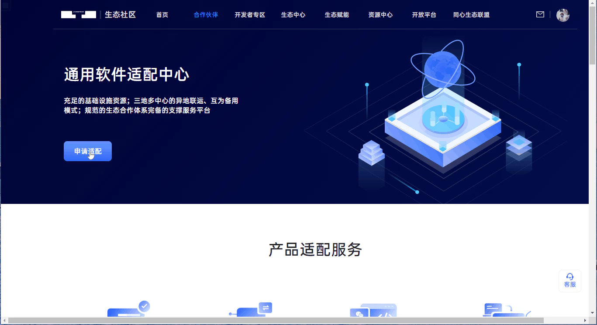

> 点击<点击申请适配>

## 步骤2: 填写认证申请表

> 点击 <+新增认证申请>
>
> 填写内容可参考如下信息(根据实际情况更改):

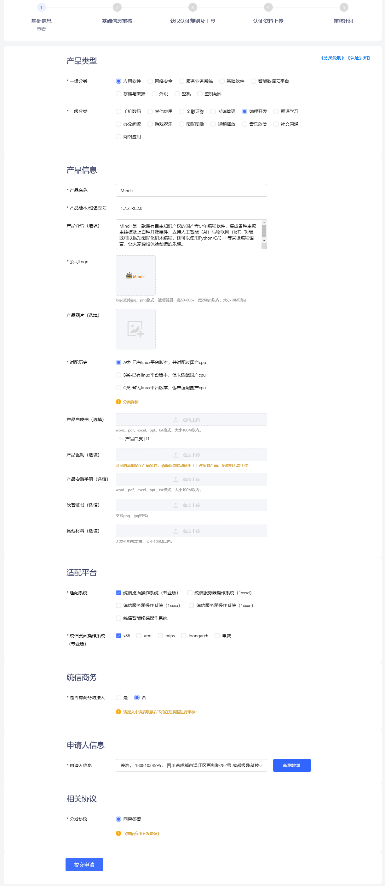

> 点击<提交申请>

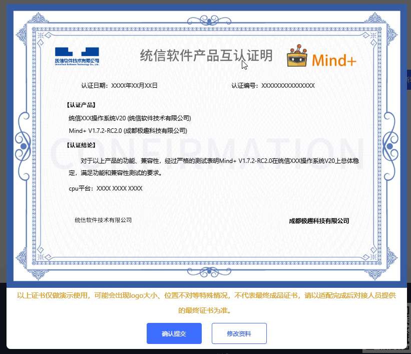

> 点击<确定提交>

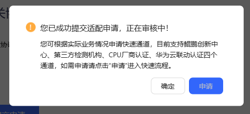

> 点击<确定>，不进入申请快速通道

## 步骤3: 开始适配

> 之后账号所有者(这里用的账号是姜大爷的)就会收到一封邮件

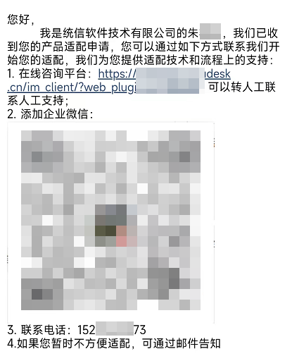

> 就是说审核已经通过了, 可以进行继续认证

> 点击<继续认证>

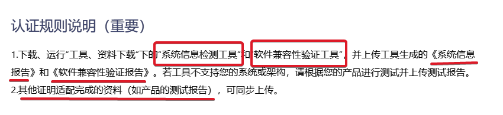

> ps: 系统信息报告可以通过他们提供的工具生成PDF文件、软件兼容性验证报告由我们自己提过

> 然后，页面翻到最下面，然后点击<下一步>
>
> 然后将文件上传上去即可
> ps. 上传软件的时候网速越快越好，不然半天都上传不上去

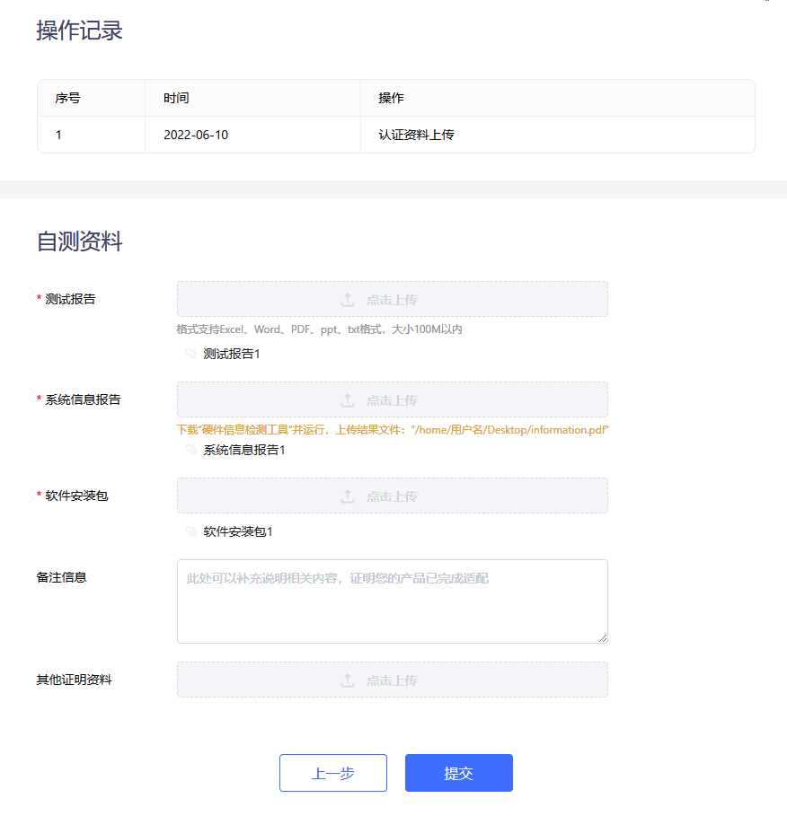

> 都上传完成后，点击<提交>

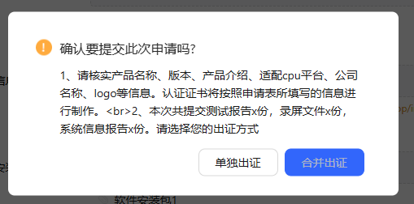

> 点击<单独出证>

---

### ❗很重要的信息

上面的测试报告、以及测试用例都要重新写，但是测试用例就随便来20-30个就可以了(覆盖全模式)

参考下面的压缩包即可(解压密码: `DFROBOT`):

 [Mind+ V1.7.2RC2.0-系统测试报告以及测试用例.zip](.\Mind+ V1.7.2RC2.0-系统测试报告以及测试用例.zip) 

## 步骤4: 评测

> 以下为吐槽，可以跳过这两张图
>
> 统信的适配界面好拉跨哦，上传的文件都收不到

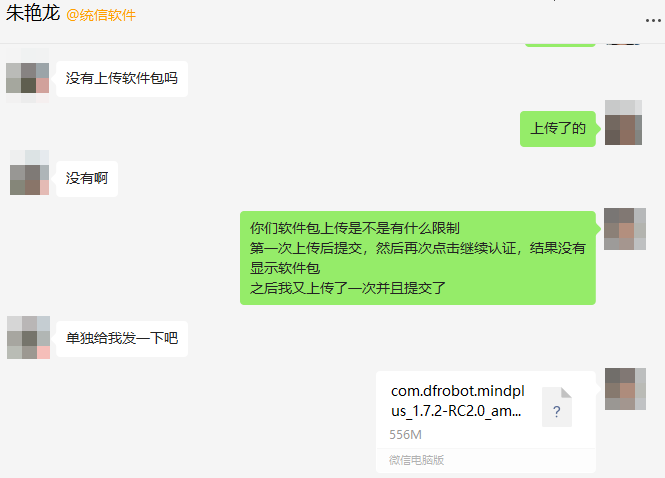

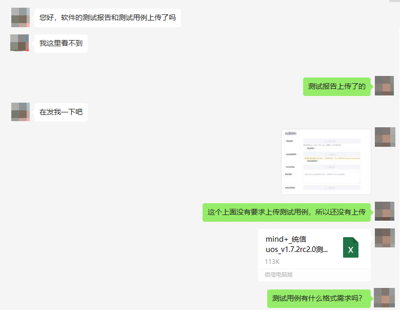

> 正片开始

这位官方人员@朱艳龙，将我和另外此次官方测试人员@薛继超拉进了群

之后就是官方测试人员提出问题，我解决问题。

问题1: `No root privileges.Please request root access in developer mode in Control Center`

答:安装驱动是需要管理员权限的

问题2: 桌面应用是不能使用root权限的

答: 改<一键安装驱动>的触发事件(编译源代码并安装)为打开链接(https://mindplus.dfrobot.com.cn/linux)

问题3: "xxxx/python" 没有通过系统安全验证，无法运行

答: 测试环境改为开发者模式测试

> 测评完毕

## 步骤5: 上架

新建应用: [统信UOS开发平台](https://appstore-dev.uniontech.com/#/management-detial?type=2)

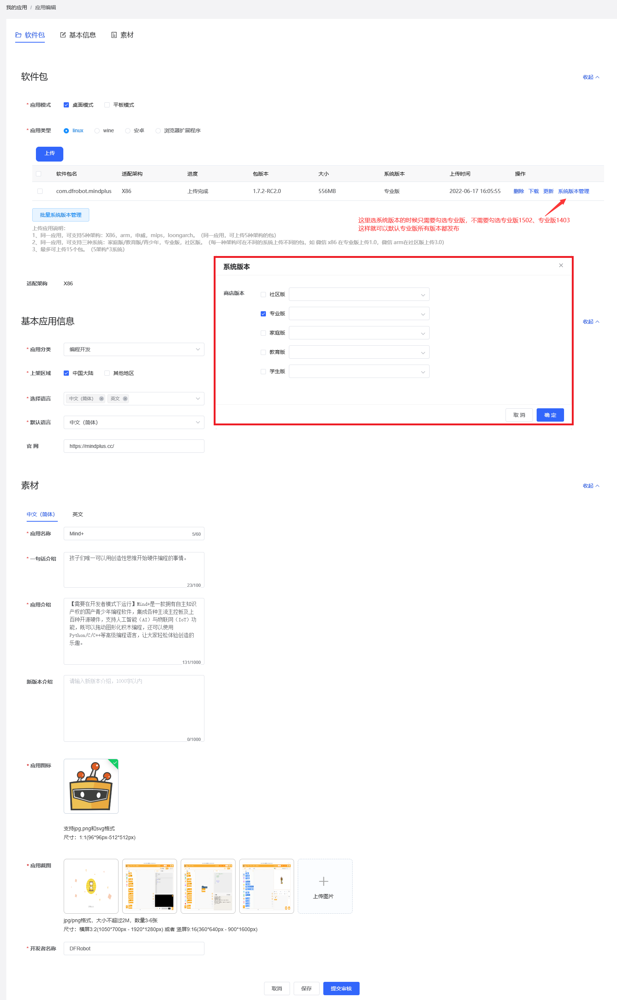

