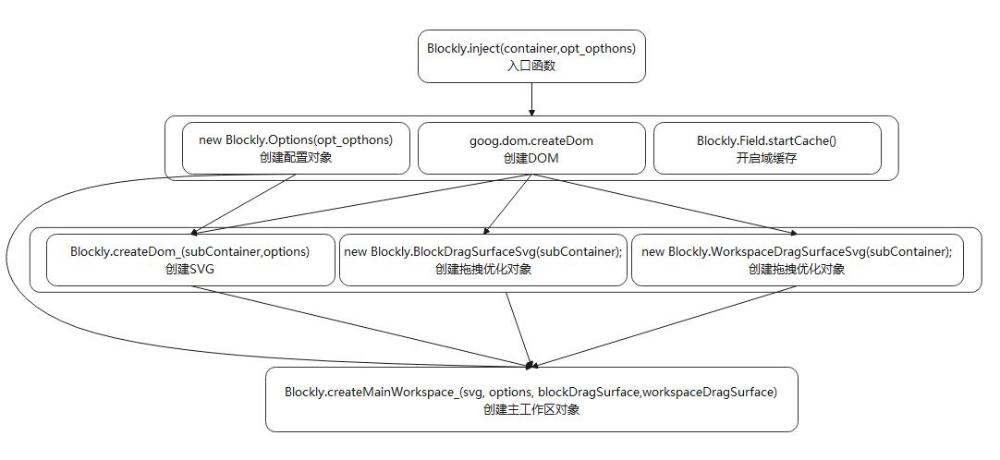
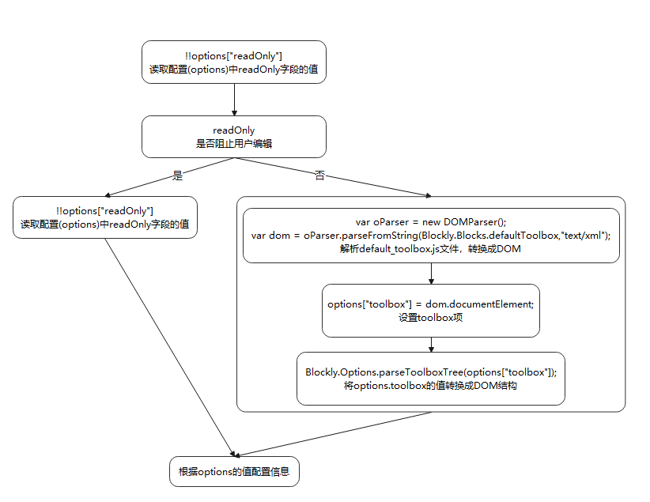
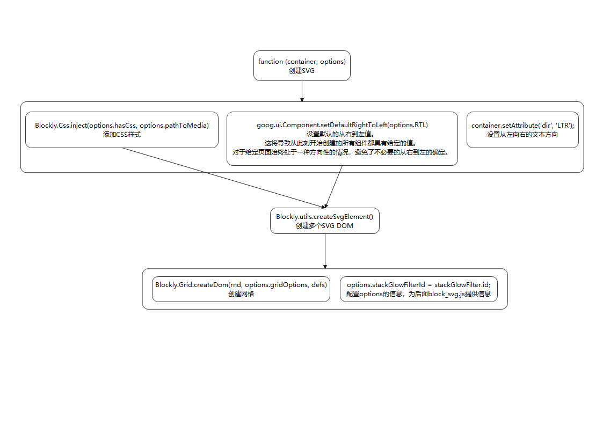
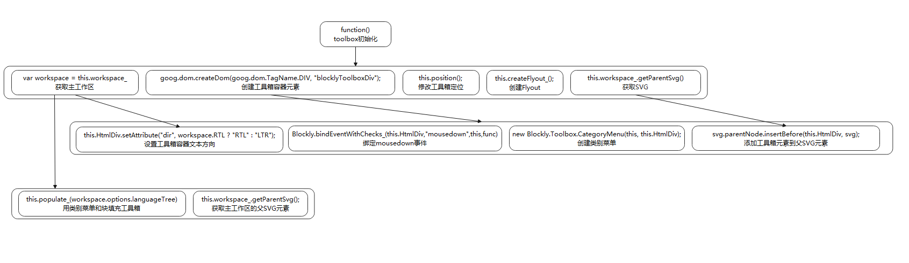
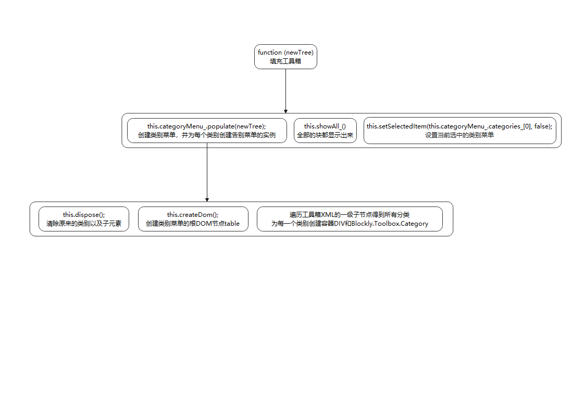
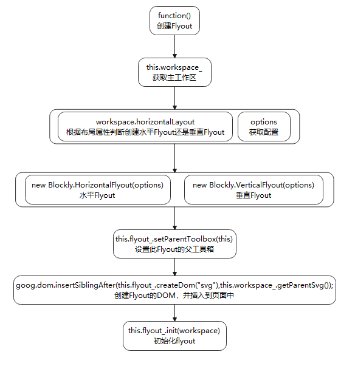

 


# Scratch block 添加block

# 第零步:添加自己的blocks_vertical

> 添加自己的block以及自己的category至默认工具栏(Toolbox)

## 0-1:创建新的blocks

> 路径：在blocks_vertical文件夹下，创建new.js

> 创建方法：
> 1. 固定写法：Blockly.Blocks['模块名称'] = {}
> 2. 添加init函数：init:function(){}
> 3. 往函数中添加包含message0、args0、category、extensions的json字符串

```javascript
Blockly.Blocks['模块名称'] = {
    init: function () {
        this.jsonInit({
            "message0": "32位无符号数%1转32位有符号数",
            "args0": [
                {
                    "type": "输入类型",
                    "name": "值名称",
                },
            ],
            "category": Blockly.Categories.new,
            "extensions": ["colours_operators", "output_number"]
        })
    }
}
```

### block形状

| block形状                                                    | block type                                          |
| ------------------------------------------------------------ | --------------------------------------------------- |
|                        | output_string<br />在后面添加<br />output: 'string' |
|                                  | output_number<br />在后面添加<br />output: 'number' |
|                      | shape_hat                                           |
|                                  | shape_end                                           |
|  | output_boolean<br />在后面添加<br />output: '' |
|  | output_string<br />在后面添加<br />output: 'string' |

### block 数据类型

| value                                                        | value type                                      | 用法                                                         |
| ------------------------------------------------------------ | ----------------------------------------------- | ------------------------------------------------------------ |
|  | input_value                                     | "type": "input_value",<br/>"name": "STEPS"                   |
|  | field_dropdown                                  | "type": "field_dropdown",<br/>"name": "TOWARDS",<br/>"options": [<br/>  [Blockly.Msg.MOTION_POINTTOWARDS_POINTER, '_mouse_'],<br/>  [Blockly.Msg.MOTION_POINTTOWARDS_RANDOM, '_random_']<br/>] |
|  | input_statement                                 | "type": "input_statement",<br/>"name": "SUBSTACK"            |
|  | field_image                                     | "type": "field_image",<br/>"src": Blockly.mainWorkspace.options.pathToMedia + "repeat.svg",<br/>"width": 24,<br/>"height": 24,<br/>"alt": "*",<br/>"flip_rtl": true |
|  | input_value                                     | "type": "input_value",<br/>"name": "COLOR"<br /><br /><br />在blocks_vertical\default_toolbox.js中添加<br />'<value name="COLOR">' +<br/>'<shadow type="colour_picker"></shadow>' +<br/>'</value>' + |
|  | field_vertical_separator(竖线)<br />input_value | "type": "field_vertical_separator"<br />"type": "input_value",<br /><br /><br />在blocks_vertical\default_toolbox.js中添加<br />'<value name="MATRIX">' +<br/>'<shadow type="matrix">' +<br/>'<field name="MATRIX">0101010101100010101000100</field>' +<br/>'</shadow>' +<br/>'</value>' + |
|  | field_variable_getter                           | "type": "field_variable_getter",<br/>"text": "",<br/>"name": "VARIABLE",<br/>"variableType": "" |


```javascript
'use strict';
// 导出
goog.provide('Blockly.Blocks.new');
// 导入
goog.require('Blockly.Blocks');
goog.require('Blockly.Colours');
goog.require('Blockly.constants');
goog.require('Blockly.ScratchBlocks.VerticalExtensions');

// new分类下，第一个模块new_and_1
Blockly.Blocks['new_and_1'] = {
    init: function () {
        this.jsonInit({
            "Blockly.Xml.textToDom": Blockly.Msg.NEW_AND_ONE,// 设置描述// 支持直接写// 这里我是在**msg\messages.js**文件中添加后，再调用的
            "args0": [
                {
                    "type": "input_value",// 输入字段类型
                    "name": "NUM",// 名称
                }
            ],
            "category": Blockly.Categories.new,// 该模块的类型
            "extensions": ["colours_operators", "output_number"]// 模块的配置，颜色，样式
        })
    }
}
Blockly.Blocks['new_and_2'] = {
    init: function () {
        this.jsonInit({
            "message0": Blockly.Msg.NEW_AND_TWO,
            "args0": [
                {
                    "type": "input_value",
                    "name": "NUM1",
                }, {
                    "type": "input_value",
                    "name": "NUM2",
                }
            ],
            "category": Blockly.Categories.new,
            "extensions": ["colours_operators", "output_number"]
        })
    }
}
Blockly.Blocks['new_and_3'] = {
    init: function () {
        this.jsonInit({
            "message0": Blockly.Msg.NEW_AND_THREE,
            "args0": [
                {
                    "type": "input_value",
                    "name": "NUM1",
                }, {
                    "type": "input_value",
                    "name": "NUM2",
                }, {
                    "type": "input_value",
                    "name": "NUM3",
                }
            ],
            "category": Blockly.Categories.new,
            "extensions": ["colours_operators", "output_number"]
        })
    }
}
```

```javascript
// New blocks 新类别
Blockly.Msg.NEW_AND_ONE = "新的组件1 %1";
Blockly.Msg.NEW_AND_TWO = "新的组件2 %1 + %2";
Blockly.Msg.NEW_AND_THREE = "新的组件3 %1 + %2 + %3";
```

## 0-2:将创建的blocks添加到默认Toolbox中

> 路径：blocks_vertical\default_toolbox.js

```javascript
'<category name="新类别" id="new" colour="#FF6680" secondaryColour="#FF4D6A" iconURI="../media/extensions/new-block-icon.svg">' +
    '<block type="new_and_1" id="new_and_one">' +
        '<value name="NUM">' +
            '<shadow type="math_number">' +
                '<field name="NUM">10</field>' +
            '</shadow>' +
        '</value>' +
    '</block>' +
    '<block type="new_and_2" id="new_and_two">' +
        '<value name="NUM1">' +
            '<shadow type="math_number">' +
                '<field name="NUM">10</field>' +
            '</shadow>' +
        '</value>' +
        '<value name="NUM2">' +
            '<shadow type="math_number">' +
                '<field name="NUM">10</field>' +
            '</shadow>' +
        '</value>' +
    '</block>' +
    '<block type="new_and_3" id="new_and_three">' +
        '<value name="NUM1">' +
            '<shadow type="math_number">' +
                '<field name="NUM">10</field>' +
            '</shadow>' +
        '</value>' +
        '<value name="NUM2">' +
            '<shadow type="math_number">' +
                '<field name="NUM">10</field>' +
            '</shadow>' +
        '</value>' +
        '<value name="NUM3">' +
            '<shadow type="math_number">' +
                '<field name="NUM">10</field>' +
            '</shadow>' +
        '</value>' +
    '</block>' +
'</category>' +
```

> 标签category(分类)，支持属性`name`(分类名称)、`id`(分类ID)、`colour`(颜色)、`secondaryColour`(二次色)、`iconURI`，其中id属于必填项。如果添加了`iconURL`属性，则`colour`、`secondaryColour`属性不会生效
> 标签block(块)，支持属性`type`(模块类型)、`id`(块ID)，block.type 对应`模块名称`
> 标签value(值)，支持属性`name`(值的名称)，value.name 对应 `值名称`
> 标签shadow(值类)，支持属性`type`(值的类型)，shadow.type 对应 `值的类型`
> 标签field，支持属性`name`，标签内的值 对应 Block 的默认值
>
> > ps.`模块名称`、 `值名称`上面创建blocks的例子里面

# 第一步:将Scrach-blocks注入页面
> 创建一个基本框架

## 入口函数Blockly.inject

> 路径：core\inject.js

```javascript
Blockly.inject = function (container, opt_options) {
  // 获取容器元素
  if (goog.isString(container)) {
    container = document.getElementById(container) ||
      document.querySelector(container);
  }
  // 验证容器是否已经在文档中
  if (!goog.dom.contains(document, container)) {
    throw 'Error: container is not in current document.';
  }
  // 创建配置对象
  var options = new Blockly.Options(opt_options || {});
  var subContainer = goog.dom.createDom('div', 'injectionDiv');
  container.appendChild(subContainer);

  // 开启缓存
  Blockly.Field.startCache();
  // 创建SVG对象(父)
  var svg = Blockly.createDom_(subContainer, options);

  // 创建拖拽优化对象
  var blockDragSurface = new Blockly.BlockDragSurfaceSvg(subContainer);
  var workspaceDragSurface = new Blockly.WorkspaceDragSurfaceSvg(subContainer);
  // 创建主工作区
  var workspace = Blockly.createMainWorkspace_(svg, options, blockDragSurface, workspaceDragSurface);
  // Blockly初始化
  Blockly.init_(workspace);
  Blockly.mainWorkspace = workspace;
  // 调整SVG图像的大小
  Blockly.svgResize(workspace);
  return workspace;
};
```



### 创建配置对象

```javascript
Blockly.Options = function (options) {
  // 读取配置(options)中readOnly字段的值,并强转为布尔类型
  var readOnly = !!options["readOnly"];
  // 通过readOnly的值进行判断
  if (readOnly) {
    // readOnly为true,阻止用户编辑
    var languageTree = null;
    var hasCategories = false;
    var hasTrashcan = false;
    var hasCollapse = false;
    var hasComments = false;
    var hasDisable = false;
    var hasSounds = false;
  } else {
    if (!options["toolbox"] && Blockly.Blocks.defaultToolbox) {
      // DOM解析器
      var oParser = new DOMParser();
      // 解析字符串为DOM
      var dom = oParser.parseFromString(
        Blockly.Blocks.defaultToolbox,
        "text/xml"
      );
      options["toolbox"] = dom.documentElement;
    }
    var languageTree = Blockly.Options.parseToolboxTree(options["toolbox"]);
    var hasCategories = Boolean(
      languageTree && languageTree.getElementsByTagName("category").length
    );
    var hasTrashcan = options["trashcan"];
    if (hasTrashcan === undefined) {
      hasTrashcan = false;
    }
    var hasCollapse = options["collapse"];
    if (hasCollapse === undefined) {
      hasCollapse = hasCategories;
    }
    var hasComments = options["comments"];
    if (hasComments === undefined) {
      hasComments = hasCategories;
    }
    var hasDisable = options["disable"];
    if (hasDisable === undefined) {
      hasDisable = hasCategories;
    }
    var hasSounds = options["sounds"];
    if (hasSounds === undefined) {
      hasSounds = true;
    }
  }
  var rtl = !!options["rtl"];
  var horizontalLayout = options["horizontalLayout"];
  if (horizontalLayout === undefined) {
    horizontalLayout = false;
  }
  var toolboxAtStart = options["toolboxPosition"];
  if (toolboxAtStart === "end") {
    toolboxAtStart = false;
  } else {
    toolboxAtStart = true;
  }

  if (horizontalLayout) {
    var toolboxPosition = toolboxAtStart
      ? Blockly.TOOLBOX_AT_TOP
      : Blockly.TOOLBOX_AT_BOTTOM;
  } else {
    var toolboxPosition =
      toolboxAtStart == rtl
        ? Blockly.TOOLBOX_AT_RIGHT
        : Blockly.TOOLBOX_AT_LEFT;
  }

  var hasScrollbars = options["scrollbars"];
  if (hasScrollbars === undefined) {
    hasScrollbars = hasCategories;
  }
  var hasCss = options["css"];
  if (hasCss === undefined) {
    hasCss = true;
  }
  var pathToMedia = "https://blockly-demo.appspot.com/static/media/";
  if (options["media"]) {
    pathToMedia = options["media"];
  } else if (options["path"]) {
    // 'path' is a deprecated option which has been replaced by 'media'.
    pathToMedia = options["path"] + "media/";
  } else {
    pathToMedia = "./static/blocks-media/";
  }
  if (options["oneBasedIndex"] === undefined) {
    var oneBasedIndex = true;
  } else {
    var oneBasedIndex = !!options["oneBasedIndex"];
  }

  Blockly.Colours.overrideColours(options["colours"]);

  var workPath = options["workPath"];
  if (workPath) {
    Blockly.workPath = workPath;
  }
  var pageNum = options["pageNum"];
  if (pageNum !== undefined) {
    Blockly.pageNum = pageNum;
  }
  // getVariableValue
  var getVariableValue = options["getVariableValue"];
  if (getVariableValue) {
    Blockly.getVariableValue = getVariableValue;
  }
  this.RTL = rtl;
  this.oneBasedIndex = oneBasedIndex;
  this.collapse = hasCollapse;
  this.comments = hasComments;
  this.disable = hasDisable;
  this.readOnly = readOnly;
  this.pathToMedia = pathToMedia;
  this.hasCategories = hasCategories;
  this.hasScrollbars = hasScrollbars;
  this.hasTrashcan = hasTrashcan;
  this.hasSounds = hasSounds;
  this.hasCss = hasCss;
  this.horizontalLayout = horizontalLayout;
  this.languageTree = languageTree;
  this.gridOptions = Blockly.Options.parseGridOptions_(options);
  this.zoomOptions = Blockly.Options.parseZoomOptions_(options);
  this.toolboxPosition = toolboxPosition;
};
```



### 创建SVG

```javascript
Blockly.createDom_ = function (container, options) {
  // 设置文本方向，从左至右
  container.setAttribute('dir', 'LTR');
  
  // 设置默认的从右到左值。
  //这将导致从此刻开始创建的所有组件都具有给定的值。
  //对于给定页面始终处于一种方向性的情况，避免了不必要的从右到左的确定
  goog.ui.Component.setDefaultRightToLeft(options.RTL);

  // 注入CSS样式
  Blockly.Css.inject(options.hasCss, options.pathToMedia);
  
  var svg = Blockly.utils.createSvgElement('svg', {
    'xmlns': 'http://www.w3.org/2000/svg',
    'xmlns:html': 'http://www.w3.org/1999/xhtml',
    'xmlns:xlink': 'http://www.w3.org/1999/xlink',
    'version': '1.1',
    'class': 'blocklySvg'
  }, container);

  var defs = Blockly.utils.createSvgElement('defs', {}, svg);
  // 随机数，为后面创建SVG的ID做准备
  var rnd = String(Math.random()).substring(2);
  // 创建SVG[Blockly.utils.createSvgElement]，省略...
  
  // 添加配置信息
  options.stackGlowFilterId = stackGlowFilter.id;
  options.replacementGlowFilterId = replacementGlowFilter.id;
  options.disabledPatternId = disabledPattern.id;
  options.selectedBlockFilterId = selectedBlockFilter.id;
  options.conflictBlockFilterId = conflictBlockFilter.id;
  options.replacementInputBlockFilterId = replacementInputBlockFilter.id;
  // 创建网格
  options.gridPattern = Blockly.Grid.createDom(rnd, options.gridOptions, defs);
  return svg;
};
```



### 创建工作区

```javascript
Blockly.createMainWorkspace_ = function (svg, options, blockDragSurface, workspaceDragSurface) {
  options.parentWorkspace = null;
  // 创建 一个带有可选垃圾桶、滚动条、气泡、以及可拖动的屏幕区域
  var mainWorkspace = new Blockly.WorkspaceSvg(options, blockDragSurface, workspaceDragSurface);
  // 设置主工作区的缩放
  mainWorkspace.scale = options.zoomOptions.startScale;
  // 添加到父SVG里面
  svg.appendChild(mainWorkspace.createDom('blocklyMainBackground'));

  // 如果option没有分类，并且存在语言树，创建Flyout
  if (!options.hasCategories && options.languageTree) {
    // 将弹出按钮添加为<svg>，它是工作区svg的同级。
    var flyout = mainWorkspace.addFlyout_('svg');
    Blockly.utils.insertAfter(flyout, svg);
  }

  // 空转换也将会应用正确的初始化比例
  mainWorkspace.translate(0, 0);
  Blockly.mainWorkspace = mainWorkspace;
  
  // 如果不是只读，并且没有滚动条，定义工作区变化处理回调函数
  if (!options.readOnly && !options.hasScrollbars) {
    var workspaceChanged = function () {
      if (!mainWorkspace.isDragging()) {
        var metrics = mainWorkspace.getMetrics();
        var edgeLeft = metrics.viewLeft + metrics.absoluteLeft;
        var edgeTop = metrics.viewTop + metrics.absoluteTop;
        if (metrics.contentTop < edgeTop ||
          metrics.contentTop + metrics.contentHeight >
          metrics.viewHeight + edgeTop ||
          metrics.contentLeft <
          (options.RTL ? metrics.viewLeft : edgeLeft) ||
          metrics.contentLeft + metrics.contentWidth > (options.RTL ?
            metrics.viewWidth : metrics.viewWidth + edgeLeft)) {
          // 如果模块超出主工作区范围，返回主工作区
          var MARGIN = 25;
          var blocks = mainWorkspace.getTopBlocks(false);
          for (var b = 0, block; block = blocks[b]; b++) {
            var blockXY = block.getRelativeToSurfaceXY();
            var blockHW = block.getHeightWidth();
            // 把顶部上面的块返回主工作区.
            var overflowTop = edgeTop + MARGIN - blockHW.height - blockXY.y;
            if (overflowTop > 0) {
              block.moveBy(0, overflowTop);
            }
            // 把底部上面的块返回主工作区.
            var overflowBottom =
              edgeTop + metrics.viewHeight - MARGIN - blockXY.y;
            if (overflowBottom < 0) {
              block.moveBy(0, overflowBottom);
            }
            // 把超过左边的块返回主工作区.
            var overflowLeft = MARGIN + edgeLeft -
              blockXY.x - (options.RTL ? 0 : blockHW.width);
            if (overflowLeft > 0) {
              block.moveBy(overflowLeft, 0);
            }
            // 把超过右边的块返回主工作区.
            var overflowRight = edgeLeft + metrics.viewWidth - MARGIN -
              blockXY.x + (options.RTL ? blockHW.width : 0);
            if (overflowRight < 0) {
              block.moveBy(overflowRight, 0);
            }
          }
        }
      }
    };
    // 工作区增加改变事件监听
    mainWorkspace.addChangeListener(workspaceChanged);
  }
  // 调整SVG图像的大小以完全填充其容器.
  Blockly.svgResize(mainWorkspace);
  // 创建浮动在Blockly之上的widget div, 并将其注入到页面中，
  // 它包含用户当前正在与之交互的临时HTML UI部件
  Blockly.WidgetDiv.createDom();
  // 创建浮动在工作区顶部的div, 用于下拉菜单
  Blockly.DropDownDiv.createDom();
  // 创建提示框div, 并将其注入到页面中
  Blockly.Tooltip.createDom();
  return mainWorkspace;
};
```


### 初始化Blockly

```javascript
Blockly.init_ = function(mainWorkspace) {
  var options = mainWorkspace.options;
  var svg = mainWorkspace.getParentSvg();
  // 绑定鼠标右键事件
  Blockly.bindEventWithChecks_(svg.parentNode, 'contextmenu', null,
                               function(e) {
    // 在事件目标不是文本输入时
    if (!Blockly.utils.isTargetInput(e)) {
      // 抑制浏览器的上下文菜单
      e.preventDefault();
    }
  });
  // 绑定窗口的resize事件
  var workspaceResizeHandler = Blockly.bindEventWithChecks_(window, 'resize',
                                                            null,function() {
    // 关闭一些元素的工具提示、上下文菜单、下拉框等, 参数为true, 不关闭工具箱
    Blockly.hideChaffOnResize(true);
    // 调整SVG图像的大小以完全填充其容器
    Blockly.svgResize(mainWorkspace);
  });
  // 保存resize处理程序的数据, 以便稍后可以删除
  mainWorkspace.setResizeHandlerWrapper(workspaceResizeHandler);
  // 绑定document的keydown、touchend、touchcancel事件
  Blockly.inject.bindDocumentEvents_();
  if (options.languageTree) {
    if (mainWorkspace.toolbox_) {
      // 初始化工具箱// mainWorkspace.toolbox_来自mainWorkspace.createDom
      mainWorkspace.toolbox_.init(mainWorkspace);
    } else if (mainWorkspace.flyout_) {
      // 初始化Flyout
      mainWorkspace.flyout_.init(mainWorkspace);
      // 展示和填充Flyout
      mainWorkspace.flyout_.show(options.languageTree.childNodes);
      // 将Flyout滚动到顶部
      mainWorkspace.flyout_.scrollToStart();
      // 根据Flyout将工作区转换到新的坐标
      if (options.horizontalLayout) {
        mainWorkspace.scrollY = mainWorkspace.flyout_.height_;
        if (options.toolboxPosition == Blockly.TOOLBOX_AT_BOTTOM) {
          mainWorkspace.scrollY *= -1;
        }
      } else {
        mainWorkspace.scrollX = mainWorkspace.flyout_.width_;
        if (options.toolboxPosition == Blockly.TOOLBOX_AT_RIGHT) {
          mainWorkspace.scrollX *= -1;
        }
      }
      // 坐标转换
      mainWorkspace.translate(mainWorkspace.scrollX, mainWorkspace.
                              scrollY);
    }
  }
  // 初始化一对滚动条, 即水平滚动条和垂直滚动条
  if (options.hasScrollbars) {
    mainWorkspace.scrollbar = new Blockly.ScrollbarPair(mainWorkspace);
    // 重新计算滚动条的位置和长度, 并重新定位角矩形
    mainWorkspace.scrollbar.resize();
  }
  // 为工作区加载声音
  if (options.hasSounds) {
    Blockly.inject.loadSounds_(options.pathToMedia, mainWorkspace);
  }
};
```


# 第二步:加载工具箱

## 初始化工具箱

```javascript
Blockly.Toolbox.prototype.init = function () {
  var workspace = this.workspace_;
  // 获取工作区的父SVG元素
  var svg = this.workspace_.getParentSvg();
  // 创建工具箱的容器元素，设置方向属性，并插入根SVG的前面
  this.HtmlDiv = goog.dom.createDom(goog.dom.TagName.DIV, "blocklyToolboxDiv");
  this.HtmlDiv.setAttribute("dir", workspace.RTL ? "RTL" : "LTR");
  // this.HtmlDiv.setAttribute('id', "toolboxId");
  svg.parentNode.insertBefore(this.HtmlDiv, svg);

  // 给容器元素绑定mousedown事件，事件触发时关闭弹窗
  Blockly.bindEventWithChecks_(this.HtmlDiv,"mousedown",this,
    function (e) {
      // 取消任何正在进行的任何手势
      this.workspace_.cancelCurrentGesture();
      if (Blockly.utils.isRightButton(e) || e.target == this.HtmlDiv) {
        // 关闭弹窗，同时关闭工具箱的Flyout
        Blockly.hideChaff(false);
      } else {
        // 关闭弹窗，不关闭工具箱的Flyou
        Blockly.hideChaff(true);
      }
      // 清除跟踪要关注的触摸流的触摸识别符，这将结束当前的拖动或手势
      // 并允许捕获其他指针
      Blockly.Touch.clearTouchIdentifier(); // Don't block future drags.
    },
    /*opt_noCaptureIdentifier*/ false,
    /*opt_noPreventDefault*/ true
  );
  
  // 基于主工作区的options选项创建和配置Flyout
  this.createFlyout_();
  // 创建工具箱的类别菜单，创建一个类别div并追加到this.HtmlDiv中
  this.categoryMenu_ = new Blockly.Toolbox.CategoryMenu(this, this.HtmlDiv);
  // 用类别和块填充工具箱
  this.populate_(workspace.options.languageTree);
  // 将工具箱移动到边缘位置
  this.position();
};
```




### 创建category，填充Toolbox

```javascript
Blockly.Toolbox.prototype.populate_ = function (newTree) {
  // 创建类别菜单，并为每一个类别创建一个类别菜单的实例，填充Toolbox
  this.categoryMenu_.populate(newTree);
  // 全部的块都显示出来
  this.showAll_();
  // 设置当前选中的类别菜单
  this.setSelectedItem(this.categoryMenu_.categories_[0], false);
};
```

```javascript
Blockly.Toolbox.CategoryMenu.prototype.populate = function (domTree) {
  // 如果DOM树为空直接返回
  if (!domTree) {
    return;
  }

  // 清除原来的类别以及子元素
  this.dispose();
  // 创建类别菜单的根DOM节点table
  this.createDom();
  var categories = [];
  // 遍历工具箱XML的一级子节点得到所有分类
  for (var i = 0, child; (child = domTree.childNodes[i]); i++) {
    if (!child.tagName || child.tagName.toUpperCase() != "CATEGORY") {
      continue;
    }
    // 遍历之后，存入节点数组中
    categories.push(child);
  }

  // 循环遍历类别数组，为每一个类别创建容器DIV和Blockly.Toolbox.Category
  for (var i = 0; i < categories.length; i++) {
    var child = categories[i];
    var row = goog.dom.createDom("div", "scratchCategoryMenuRow");
    this.table.appendChild(row);
    if (child) {
      // 创建类别
      this.categories_.push(new Blockly.Toolbox.Category(this, row, child));
    }
  }
  this.height_ = this.table.offsetHeight;
};
```

```javascript
Blockly.Toolbox.prototype.showAll_ = function () {
  var allContents = [];
  for (var i = 0; i < this.categoryMenu_.categories_.length; i++) {
    var category = this.categoryMenu_.categories_[i];

    // 创建一个label标签节点，使其位于类别的顶点
    var labelString =
      '<xml><label text="' +
      category.name_ +
      '"' +
      ' id="' +
      category.id_ +
      '"' +
      ' category-label="true"' +
      ' showStatusButton="' +
      category.showStatusButton_ +
      '"' +
      ' web-class="categoryLabel">' +
      "</label></xml>";
    // 将纯文本转换成DOM结构
    var labelXML = Blockly.Xml.textToDom(labelString);
    // 把label标签放入allContents
    allContents.push(labelXML.firstChild);
		// 把当前类别下的所有block标签放入allContents
    allContents = allContents.concat(category.getContents());
  }
	
  try {
    // 把 allContents中的内容在flyout中展现出来
    this.flyout_.show(allContents);
  } catch (e) {
    console.log("error", e);
  }
};
```

```javascript
Blockly.Toolbox.prototype.setSelectedItem = function (item, opt_shouldScroll) {
  // 如果没传参数 opt_shouldScroll,则默认为true，滚动到所选分类的顶部
  if (typeof opt_shouldScroll === "undefined") {
    opt_shouldScroll = true;
  }
  // 如果当前有选中的类，先去掉它的选中状态
  if (this.selectedItem_) {
    // They selected a different category but one was already open.  Close it.
    this.selectedItem_.setSelected(false);
  }
  // 赋值当前选中状态
  this.selectedItem_ = item;
  if (this.selectedItem_ != null) {
    // 设置选中状态
    this.selectedItem_.setSelected(true);
    // Scroll flyout to the top of the selected category
    var categoryId = item.id_;
    if (opt_shouldScroll) {
      // 滚动Flyout到当前选中类别的顶部
      this.scrollToCategoryById(categoryId);
    }
  }
};
```



### 创建Flyout

```javascript
Blockly.Toolbox.prototype.createFlyout_ = function () {
  var workspace = this.workspace_;
	// 基于主工作区的options产生Flyout的配置对象
  var options = {
    disabledPatternId: workspace.options.disabledPatternId,
    parentWorkspace: workspace,
    RTL: workspace.RTL,
    oneBasedIndex: workspace.options.oneBasedIndex,
    horizontalLayout: workspace.horizontalLayout,
    toolboxPosition: workspace.options.toolboxPosition,
    stackGlowFilterId: workspace.options.stackGlowFilterId
  };
	// 根据布局属性判断创建水平Flyout还是垂直Flyout
  if (workspace.horizontalLayout) {
    this.flyout_ = new Blockly.HorizontalFlyout(options);
  } else {
    this.flyout_ = new Blockly.VerticalFlyout(options);
  }
  // 设置此Flyout的父工具箱
  this.flyout_.setParentToolbox(this);
	// 创建Flyout的DOM，并插入到页面中
  goog.dom.insertSiblingAfter(
    this.flyout_.createDom("svg"),
    this.workspace_.getParentSvg()
  );
  // 初始化flyout
  this.flyout_.init(workspace);
};
```



# 总结·整体流程


Scratch-Blocks是Google的Blockly项目的一个分支，该项目提供了用于构建图形化计算接口的设计规范和代码库。Blockly项目在前文描述过，我们使用时，可以通过拖拽的形式将积木从工具栏中放在工作空间，运行时，将工作空间的积木转为对应高级语言，执行高级语言既可以获得执行结果。

简单来说，就是用来定义Block块的形状、Block块的功能
