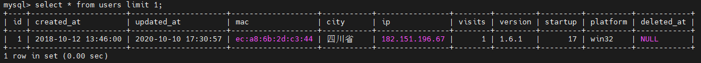

# 用户数据库
>
>SSH账号: root
>
>SSH 密码: Hidf***\*\*\*t5353
>
>数据库用户: root
>
>数据库密码: hidf***\*\*\*t

## 数据库

| 库名               | 备注                 | 
| ------------------ | -------------------- |
| statistic          | 用户数据库(MindPlus) |
| information_schema |                      |
| golang123          |                      |
| mysql              |                      |
| performance_schema |                      |
| studygolang        |                      |
| sys                |                      |
| testgorm           |                      |


## 用户库的数据表

| 表名                   | 备注             | 是否还在使用 |
| ---------------------- | ---------------- | ------------ |
| users                  | 用户信息表       | ⭕           |
| feed_backs             | 反馈信息表       | ⭕           |
| collect_settings       | 设置信息表       | ❌           |
| collect_screens        | 屏幕信息表       | ❌           |
| collect_products       | 产品信息表       | ❌           |
| collect_pageviews      | 页面模式表       | ❌           |
| collect_modules        | 模块信息表       | ❌           |
| collect_libraries      | 操作角色表       | ❌           |
| collect_jump_outers    | 打开外联的测试表 | ❌           |
| collect_error_infos    | 错误信息表       | ❌           |
| collect_code_modes     | 使用语言表       | ❌           |
| collect_code_languages | 生成代码表       | ❌           |

## 打开用户表

### 进入数据库

#### 明文登录(不推荐) 然后进入数据库

```shell
> mysql -u root -phidfrobot
> use statistic
```

#### 隐藏登录(推荐) 直接进入数据库

```shell
> mysql -u root -p statistic
Enter password:# 这里输入数据库密码(不会显示出来)
```

### 查询数据库

```mysql
show databases;
```

### 切换数据库

```mysql
use databaseName;
```

> 例如，进入一个名为xx的数据库

```mysql
use xx;
```

### 查询表

```mysql
show tables;
```

## 查询数据



### 查询当前用户数量

```mysql
select count(*) from users;
```

### 查询今年新创建用户数量

```mysql
# 方法1
select count(*) from users where date_format(created_at, "%Y") = date_format(NOW(), "%Y");
# 方法2
select count(*) from users where year(created_at) = date_format(NOW(), "%Y");
```

### 查询一条数据

```mysql
select * from users limit 1;
```

## 退出数据库

```mysql
exit;
```

## 备份数据库

> 当磁盘空间不够的时候，可以删除以前的数据库备份文件

```shell
mysqldump -uroot -p statistic > /var/mindplusSqlBak/220407.sql
```

> ps. `220407.sql` 根据时间自己改

## 导出数据

`into outfile`导出到`哪里`去

`fields terminated by`各值用`什么`隔开

`enclosed by` 用`什么`闭合

`lines terminated by`每一行用`什么`隔开

```mysql
select * into outfile '/var/lib/mysql-files/2022年5月.csv'
fields terminated by ',' enclosed by '"'
lines terminated by '\r'
from users
where date_format(created_at,'%y') = date_format(now(),'%y')
and date_format(created_at,'%m') = 5;

  
  

select * into outfile '/var/lib/mysql-files/2022年6月.csv'
fields terminated by ',' enclosed by '"'
lines terminated by '\r'
from users
where date_format(created_at,'%y') = date_format(now(),'%y')
and date_format(created_at,'%m') = 6;
```