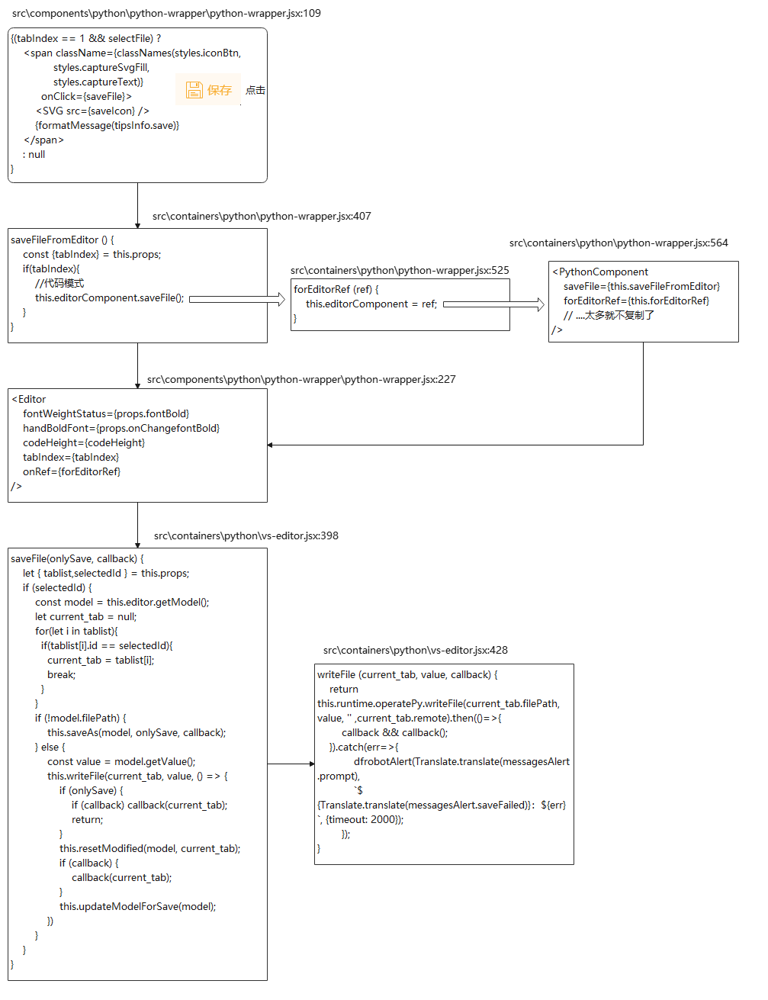
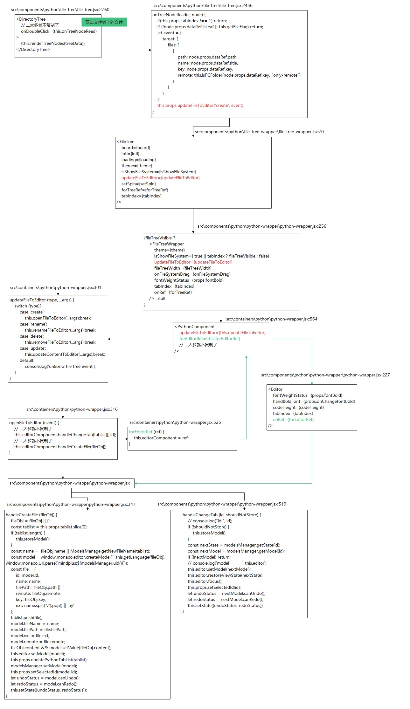
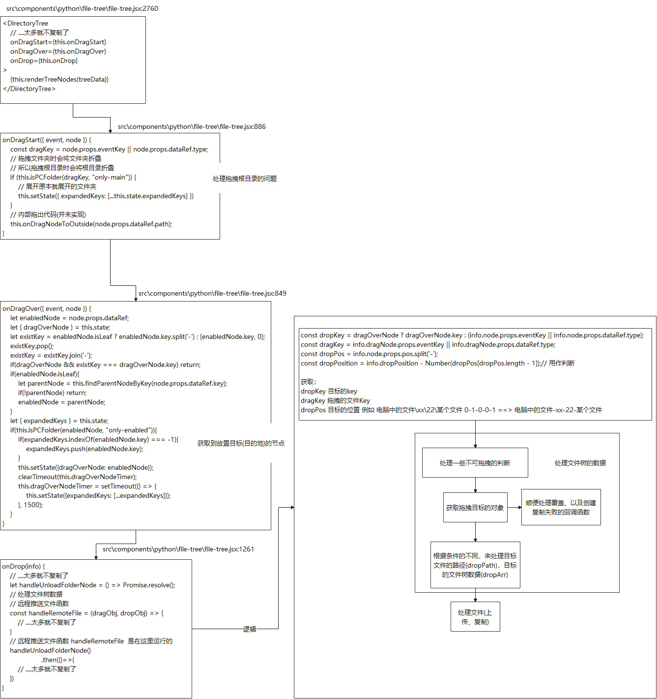

# 行空板

## 显示开关

### (行空板)扩展库触发

src\containers\python\python-blocks.jsx

```jsx
// 895
handleExtensionAdded (categoryInfo, isRefresh) {
    ....
    this.toggleConnectDevice(categoryInfo);
}
// 1226
toggleConnectDevice (info) {
    ....
    // 查看板子信息
    for(let type in this.props.extensionData){
        if(pythonExtensionType[type]){
            connectDeviceExt = this.props.extensionData[type][0].find(item=>item.extensi
            if(!connectDeviceExt) connectDeviceExt = this.props.extensionData[type][1].f
            if(connectDeviceExt) break;
        }
    }
    // 查看板子是否需要显示远程连接开关
    // 设置为显示远程连接
    if(connectDeviceExt && connectDeviceExt.connectDevice) {
        return this.props.onChangeConnectDeviceMenu(true,
            ....
        )
    }
}
// 1542
onChangeConnectDeviceMenu: (status, boardInfo) => {
    dispatch(changeConnectDevice(status, boardInfo))
}
```

### 终端触发

src\components\python\xterm-wrapper\xterm-wrapper.jsx

```jsx
// 634
this.props.onShowConnectMenu(true)} 
      style={{cursor: 'pointer'}}
      src={sshConnectIcon} />          
<span onClick={()=>this.props.onShowConnectMenu(true)}
    className={classNames(styles.toolItem, styles.active)} 
    title={this.operatePy.deviceManager.isConnected()? '': formatMessage(messages.toRestartXterm)}
    onDoubleClick={this.restartXterm} />
// 702
onShowConnectMenu: (status) => {
    dispatch(showConnectMenu(status))
}
```


## UI(SSH连接组件开关)

### 库文件

src\components\connect-device\connect-device.jsx

src\components\menu-bar\menu-bar.jsx

src\containers\menu-bar.jsx

src\components\gui\gui.jsx

src\containers\gui.jsx

### 操作逻辑

src\containers\gui.jsx:547

```jsx
<GUIComponent
    interfaceIndex={activeInterface}
    isLoadProject={this.state.isLoadProject}
    refresh={this.state.refresh}
    onInterfaceSelect={this.handleInterfaceSelect}
    onRefresh={this.handleRefresh}
    onSetIsLoadProject={this.handleSetIsLoadProject}
/>
```

src\components\gui\gui.jsx

```jsx
// 48
let TopMenu = MenuBar;
// 50
TopMenu = ProjectLoaderHOC(MenuBar);
// 80
<TopMenu
    onInterfaceSelect={onInterfaceSelect}
    onRefresh={onRefresh}
/>
```

src\containers\menu-bar.jsx:156

```jsx
<MenuBarComponent
    activeInterface={activeInterface}
    closeSettingPage={this.closeSettingPage}
    closeFeedBack={this.closeFeedBack}
    disableClick={disableClick}
    downloadUpdateShow={downloadUpdateShow}
    locale={this.props.localeLanguage}
    openSettingPage={this.openSettingPage}
    openFeedBack={this.openFeedBack}
    onRefresh={onRefresh}
    settingPageState={this.state.settingPageState}
    feedbackState={isShowFeedback}
    theme={theme}
    onInterfaceSelect={onInterfaceSelect}
    isRtl={isRtl}
    vm={vm}
    loginModalVisible={loginModalVisible}
    userSpaceVisible={userSpaceVisible}
    connectDevice={connectDevice}
/>
// connectDevice 使用通过redux进行获取的
```

src\components\menu-bar\menu-bar.jsx:124

```jsx
{ (activeInterface === 2 && this.props.connectDevice) ? (
    <ConnectDevice
        className={classNames(
            styles.menuItem
        )}
        theme={theme}
    />): null
}
// 当页面是Python模式(索引为2)并且触发connectDevice
```

src\components\connect-device\connect-device.jsx

> 远程连接菜单

```jsx
// 73 连接功能的实现方法 - 主
let handleConnectDevice ....太多就不复制了
// 208 连接功能的实现方法 - 包->主
const handleInputAddressInfo ....太多就不复制了
// 359 菜单 or 触发ui菜单配置
const menu ....太多就不复制了
// 416 触发ui
// 检测connectStatus修改ui名称
<Dropdown overlay={menu} placement="bottomLeft">
    <Button>
        {(connectStatus === DEVICE_STATUS.DEVICE_READY ? connectIP.current.address
            : (formatMessage(connectStatus === DEVICE_STATUS.DEVICE_CONNECTING ? me
                : messages.connectDevice)))
        }
    </Button>
</Dropdown>
```

## SSH连接

### 库文件

src\components\connect-device\connect-device.jsx

src\lib\python\operate.js

src\lib\python\ssh-manage\connect-ssh.js

### 操作逻辑

src\components\connect-device\connect-device.jsx

```jsx
// 73 连接功能的实现方法 - 主
let handleConnectDevice ....太多就不复制了
// 93 属于 73 里面的
deviceManager.connect(addressInfo, remoteBoardRef.current);
// 166 
let deviceManager = vm.runtime.operatePy.deviceManager;
setDeviceManager(deviceManager);
```

> ps. vm.runtime.operatePy 是同样在这个文件进行绑定的

```jsx
// 22
import PythonOperate from '../../lib/python/operate.js';
// 163
if (!vm.runtime.operatePy) {
    let pythonOperate = new PythonOperate(vm.runtime);
    vm.runtime.attachMethod("operatePy", pythonOperate);
}
```

src\lib\python\operate.js

```jsx
// 10
import ConnectSSH from "./ssh-manage/connect-ssh";
// 37
this.deviceManager = new ConnectSSH(this);
```

src\lib\python\ssh-manage\connect-ssh.js

```jsx
// 79
connect(info, boardInfo) {
    this.checkInBoard(info, boardInfo); 
    if (JSON.stringify(this.board.defaultInfo) !== JSON.stringify(this.board.info)){
        dfrobotUtil.setMultiConfig('pyConfig-pythonBoard-sshAccount', this.board.info);
    }  
    this.initCommand();
}
// 111 设置板子信息
checkInBoard (info, boardInfo) { ... }
// 200 ssh连接功能
initCommand(successFun, failedFun) { ... }
```

## 推送至远程&&远程运行

### 库文件

src\components\python\python-wrapper\python-wrapper.jsx

src\containers\python\python-wrapper.jsx

src\components\python\python-wrapper\python-wrapper.jsx

src\components\python\xterm-wrapper\xterm-wrapper.jsx

src\lib\python\operate.js

src\lib\python\ssh-manage\connect-ssh.js

### 操作逻辑

src\components\python\python-wrapper\python-wrapper.jsx

> 点击运行

```jsx
// 134
<span className={classNames(styles.iconBtn, 
        styles.execute,
        styles.captureSvg, 
        styles.captureText)}
    title={formatMessage(executeStatus ? tipsInfo.executing : tipsInfo.execute)}
    onClick={executeStatus ? () => stopExecute() : runFile}
>
    <SVG src={executeStatus ? stopIcon : executeIcon}
    />
    {formatMessage(executeStatus ? tipsInfo.stop : tipsInfo.execute)}
</span>
```

src\containers\python\python-wrapper.jsx

> 触发功能 runFileFromEditor
>
> 触发功能 this.xtermComponent.executeCode

```jsx
// 415
runFileFromEditor () {
    ....太多就不复制了
    // 代码模式
    this.xtermComponent.executeCode("", curent_tab.remote);
    ....太多就不复制了
    //积木模式
    code && this.xtermComponent.executeCode(code, model.remote);
    ....太多就不复制了
}
// 529
forXtermRef (ref) {
    this.xtermComponent = ref;
}
// 564
<PythonComponent
    // ....太多就不复制了
    forXtermRef={this.forXtermRef}
    runFile={this.runFileFromEditor}
    // ....太多就不复制了
/>
```

src\components\python\python-wrapper\python-wrapper.jsx

```jsx
<XtermWrapper
    // ....太多就不复制了
    onRef={forXtermRef}
/>
```

src\components\python\xterm-wrapper\xterm-wrapper.jsx

```jsx
// 335
executeCode(code, remote) {
    // ....太多就不复制了
	this.executeFile(selectFile.filePath, remote);
}
// 354
executeFile(filePath, remote) {
    // ....太多就不复制了
    this.pythonFile = this.operatePy.executeCommandRealTime({ filePath, remote }
        // ....太多就不复制了
    }
}
```

src\lib\python\operate.js

```jsx
// 10
import ConnectSSH from "./ssh-manage/connect-ssh";
// 37
this.deviceManager = new ConnectSSH(this);
// 735
executeCommandRealTime(fileObj, app, name, exitCallBack) {
    let run_path = fileObj.filePath || fileObj;
    let remote = fileObj.remote;
    // 项目中的文件与远程文件调用远程cmd运行，其余地址本地运行
    if (app == 'python-file' 
        && (run_path.match(new RegExp(this.userdir.replace(/\\/g,'\\\\'))) 
        || remote)
         && this.deviceManager.isConnected()
    ) {
        this.deviceManager.executeFile("python", run_path, name, exitCallBack);
        return;
    }
    // ....太多就不复制了
}

```

src\lib\python\ssh-manage\connect-ssh.js

```jsx
// 586
this.handleInput = (input) => {
    // ....太多就不复制了
    this.streamTerminal.write(input + "\n");
}
// 666
this.executeFile = (program, originfilepath, projectName, exitCallBack) => {
    // ....太多就不复制了
    this.writeInTerminal('\r\n');
	this.writeInTerminal(formatMessage(messages.projectUploadSuccess)+'\r\n');
    this.handleInput('export DISPLAY=:0.0\r');
    this.handleInput('xhost + \r');
    this.handleInput(`cd "${path.dirname(originfilepath)}"\r`);
    this.handleInput(command + '\r');
}
```

## PIP管理

### 库文件

src\containers\python\python-wrapper.jsx

src\components\python\python-wrapper\python-wrapper.jsx

src\containers\python\pip-manager.jsx

src\components\python\pip-manager\pip-manager.jsx

> src\components\python\pip-manager\pip-list.jsx

> src\components\python\pip-manager\commendatory-library.jsx

> src\components\python\pip-manager\handle-install.jsx

### 操作逻辑

src\containers\python\python-wrapper.jsx

```jsx
// 446
handleTogglePIPManger (checked) {
    this.setState({isPipManagerVisible: checked });
}
// 546
<PythonComponent
    // ....太多就不复制了
    //推荐库
    networkList={networkList}
    onTogglePIPManger={this.handleTogglePIPManger}
/>
```

src\components\python\python-wrapper\python-wrapper.jsx

```jsx
// 10
import PIPManagerModal from '../../../containers/python/pip-manager.jsx';
// 250
{pipManagerVisible ?
    <PIPManagerModal
        onTogglePIPManger={onTogglePIPManger}
        networkList={networkList}
    /> : null
}
```

src\containers\python\pip-manager.jsx

```jsx
// 69 切换源
handleChangePIPSource (value){
    let operatePy = this.props.vm.runtime.operatePy;
    this.setState({pipsource: value.key});
    operatePy.setPIPSource(value.key).then(data=>{
    }).catch(error=>{
      console.log('set pip source error');
    });
}
// 78 切换PIP管理器页码
handlePIPTabChange (key){
    this.setState({activeTab: key});
    //let operatePy = this.props.vm.runtime.operatePy;
}
// 84 生成HTML代码
setInstallContent (content, type, empty) {
   // ....太多就不复制了
}
// 121 PIP下载界面的Ref
handleInstallRef (ref){
    this.handleComponent = ref;
}
// 131
<PIPManagerComponent
    vm={vm}
    theme={theme}
    pipList={pipList}
    networkList={networkList}
    onRequestClose={onTogglePIPManger}
    changePIPSource={this.handleChangePIPSource}
    onPIPTabChange={this.handlePIPTabChange}
    setInstallContent={this.setInstallContent}
    handleInstallRef={this.handleInstallRef}
    remoteConnect={remoteConnect}
    remoteBoardInfo={remoteBoardInfo}
/>
```

src\components\python\pip-manager\pip-manager.jsx

```jsx
// 93 PIP已安装列表界面
{ (activeTab=="0") &&
  <PIPListTab activeTab={activeTab == "0"}
              setInstallContent={setInstallContent}
          />
}
// 104 PIP推荐库列表界面
{ (activeTab=="1") &&
  <CommendatoryLibary activeTab={activeTab == "1"}
                      networkList={networkList}
                      setInstallContent={setInstallContent}
                />
}
// 116 PIP安装工具界面
{ (activeTab=="2") &&
  <HandleInstallTab activeTab={activeTab == "2"}
                    setInstallContent={setInstallContent}
                    onRef={handleInstallRef}   />
}
// 125 PIP源切换
<DropdownMenu
    className={styles.dropdown}
    menus={pipSourceList.slice(1, pipSourceList.length)}
    value={pipsource_in || pipSourceList[0].content}
    onChange={changePIPSource}
    disabled={false}
/>
```

src\components\python\pip-manager\pip-list.jsx

> PIP已安装列表界面

```jsx
// 129 pip更新
async onHandleUpdateAll() {
    // ....太多就不复制了
}
// 222 pip卸载
async onHandleUninstallAll() {
    // ....太多就不复制了
}
```

src\components\python\pip-manager\commendatory-library.jsx:72

> PIP推荐库列表界面

```jsx
getListFromNetWork () {
    let {networkList} = this.props;
    if(networkList.COMMENDATORY_TYPE && networkList.COMMENDATORY_LIST){
        let list = this.dealTranslate(networkList);
        this.setState({commendatoryType: list.COMMENDATORY_TYPE, commendatoryList: list.COMMENDATORY_LIST});
        this.updateListWithInstalled(list);
    }else{
        this.updateListWithInstalled();
    }
}
```

src\components\python\pip-manager\handle-install.jsx

> PIP安装工具界面界面

## 文件管理

### 操作逻辑

#### 写入(保存)

src\components\python\python-wrapper\python-wrapper.jsx:109

```jsx
{(tabIndex == 1 && selectFile) ?
    <span className={classNames(styles.iconBtn,
              styles.captureSvgFill, 
              styles.captureText)} 
          onClick={saveFile}>
        <SVG src={saveIcon} />
        {formatMessage(tipsInfo.save)}
    </span>
    : null
}
```

src\containers\python\python-wrapper.jsx

```jsx
// 407
saveFileFromEditor () {
    const {tabIndex} = this.props;
    if(tabIndex){
        //代码模式
        this.editorComponent.saveFile();
    }
}
// 525
forEditorRef (ref) {
    this.editorComponent = ref;
}
// 564
<PythonComponent
    saveFile={this.saveFileFromEditor}
    forEditorRef={this.forEditorRef}
    // ....太多就不复制了
/>
```

src\components\python\python-wrapper\python-wrapper.jsx:227

```jsx
<Editor
    fontWeightStatus={props.fontBold}
    handBoldFont={props.onChangefontBold}
    codeHeight={codeHeight}
    tabIndex={tabIndex}
    onRef={forEditorRef}
/>
```

src\containers\python\vs-editor.jsx

```jsx
// 398
saveFile(onlySave, callback) {
    let { tablist,selectedId } = this.props;
    if (selectedId) {
        const model = this.editor.getModel();
        let current_tab = null;
        for(let i in tablist){
          if(tablist[i].id == selectedId){
            current_tab = tablist[i];
            break;
          }
        }
        if (!model.filePath) {
            this.saveAs(model, onlySave, callback);
        } else {
            const value = model.getValue();
            this.writeFile(current_tab, value, () => {
                if (onlySave) {                        
                    if (callback) callback(current_tab);  
                    return;
                }
                this.resetModified(model, current_tab);
                if (callback) {
                    callback(current_tab);
                }
                this.updateModelForSave(model);
            })
        }
    }
}
// 428
writeFile (current_tab, value, callback) {
    return this.runtime.operatePy.writeFile(current_tab.filePath, value, '' ,current_tab.remote).then(()=>{
        callback && callback();
    }).catch(err=>{
            dfrobotAlert(Translate.translate(messagesAlert.prompt),
            `${Translate.translate(messagesAlert.saveFailed)}：${err}`, {timeout: 2000});
        });        
}
```

#### 读取

src\components\python\file-tree\file-tree.jsx

```jsx
// 2456
onTreeNodeRead(e, node) {
    if(this.props.tabIndex !== 1) return;
    if (!node.props.dataRef.isLeaf || this.getFileFlag) return;
    let event = {
        target: {
            files: [
                {
                    path: node.props.dataRef.path, 
                    name: node.props.dataRef.title, 
                    key: node.props.dataRef.key, 
                    remote: this.isPCFolder(node.props.dataRef.key, "only-remote")
                }
            ]
        }
    };
    this.props.updateFileToEditor('create', event);
}
// 2760
<DirectoryTree
    // ....太多就不复制了
    onDoubleClick={this.onTreeNodeRead}
>
    {this.renderTreeNodes(treeData)}
</DirectoryTree>
```

src\components\python\file-tree-wrapper\file-tree-wrapper.jsx

```jsx
// 7
import FileTree from '../file-tree/file-tree.jsx';
// 70
<FileTree
    board={board}
    intl={intl}
    loading={loading}
    theme={theme}
    isShowFileSystem={isShowFileSystem}
    updateFileToEditor={updateFileToEditor}
    setSpin={setSpin}
    forTreeRef={forTreeRef}
    tabIndex={tabIndex}
/>
```

src\components\python\python-wrapper\python-wrapper.jsx

```jsx
// 18
import FileTreeWrapper from '../../../containers/python/file-tree-wrapper.jsx';
// 256
{fileTreeVisible ?
    <FileTreeWrapper
        theme={theme}
        isShowFileSystem={ true || tabIndex ? fileTreeVisible : false}
        updateFileToEditor={updateFileToEditor}
        fileTreeWidth={fileTreeWidth}
        onFileSystemDrag={onFileSystemDrag}
        fontWeightStatus={props.fontBold}
        tabIndex={tabIndex}
        onRef={forTreeRef}
    /> : null
}
```

src\containers\python\python-wrapper.jsx

```jsx
// 14
import PythonComponent from '../../components/python/python-wrapper/python-wrapper.jsx';
// 301
updateFileToEditor (type, ...args) {
    switch (type){
        case 'create':
            this.openFileToEditor(...args);break;
        case 'rename':
            this.renameFileToEditor(...args);break;
        case 'delete':
            this.removeFileToEditor(...args);break;
        case 'update':
            this.updateContentToEditor(...args);break;
        default:
            console.log('unkonw file tree event');
    }
}
// 316
openFileToEditor (event) {
    // ....太多就不复制了
    this.editorComponent.handleChangeTab(tablist[j].id);
    // ....太多就不复制了
    this.editorComponent.handleCreateFile(fileObj);
}
// 525
forEditorRef (ref) {
    this.editorComponent = ref;
}
// 564
<PythonComponent
    updateFileToEditor={this.updateFileToEditor}
    forEditorRef={this.forEditorRef}
    // ....太多就不复制了
/>
```

src\components\python\python-wrapper\python-wrapper.jsx:227

```jsx
<Editor
    fontWeightStatus={props.fontBold}
    handBoldFont={props.onChangefontBold}
    codeHeight={codeHeight}
    tabIndex={tabIndex}
    onRef={forEditorRef}
/>
```

src\containers\python\vs-editor.jsx

```jsx
// 347
handleCreateFile (fileObj) {
    fileObj = fileObj || {};
    const tablist = this.props.tablist.slice(0);
    if (tablist.length) {
        this.storeModel();
    }
    const name =  fileObj.name || ModelsManage.getNewFileName(tablist);
    const model = window.monaco.editor.createModel('', this.getLanguage(fileObj), window.monaco.Uri.parse(`mindplus:${modelsManager.uid()}`));
    const file = {
        id: model.id,
        name: name,
        filePath:  fileObj.path || '',
        remote: fileObj.remote,
        key: fileObj.key,
        ext: name.split(".").pop() || 'py'
    };
    tablist.push(file);
    model.fileName = name;
    model.filePath = file.filePath;
    model.ext = file.ext;
    model.remote = file.remote;
    fileObj.content && model.setValue(fileObj.content);
    this.editor.setModel(model);
    this.props.updatePythonTabList(tablist);
    modelsManager.setModel(model);
    this.props.setSelectedId(model.id);
    let undoStatus = model.canUndo();
    let redoStatus = model.canRedo();
    this.setState({undoStatus, redoStatus});
}
// 519
handleChangeTab (id, shouldNotStore) {
    // console.log("id:", id);
    if (!shouldNotStore) {
        this.storeModel()
    }
    const nextState = modelsManager.getState(id);
    const nextModel = modelsManager.getModel(id);
    if (!nextModel) return;
    // console.log('model====', this.editor);
    this.editor.setModel(nextModel);
    this.editor.restoreViewState(nextState);
    this.editor.focus();
    this.props.setSelectedId(id);
    let undoStatus = nextModel.canUndo();
    let redoStatus = nextModel.canRedo();
    this.setState({undoStatus, redoStatus});
}
```

### 图片示意图

#### 保存



#### 读取



## 文件树

### 操作逻辑

#### 右键菜单

src\components\python\file-tree\file-tree.jsx

```jsx
// 1655
onRightClick(e) {
    // e.event.stopPropagation();
    this.setState({
        rightClickNodeTreeItem: {
            node: e.node
        }
    });
}
// 1664
getRightClickMenu() {
    // ....太多就不复制了
    // 通过react-contextmenu进行创建右键菜单
    // 复制、粘贴、等等功能也在这里
}
// 2755
<ContextMenuTrigger
    id={`file-tree-contextmenu`}
    attributes={{
    }}
>
    <DirectoryTree
        // ....太多就不复制了
        onRightClick={eventsFlag ? this.onRightClick : null}
    >
        {this.renderTreeNodes(treeData)}
    </DirectoryTree>
</ContextMenuTrigger>
{this.getRightClickMenu()}
```

#### 文件拖动

src\components\python\file-tree\file-tree.jsx

```jsx
// 886
onDragStart({ event, node }) {
    const dragKey = node.props.eventKey || node.props.dataRef.type;
    // 拖拽文件夹时会将文件夹折叠
    // 所以拖拽根目录时会将根目录折叠
    if (this.isPCFolder(dragKey, "only-main")) {
        // 展开原本就展开的文件夹
        this.setState({ expandedKeys: [...this.state.expandedKeys] })
    }
    // 内部拖出代码(并未实现)
    this.onDragNodeToOutside(node.props.dataRef.path);
}
// 849
onDragOver({ event, node }) {
    /* let outFile = event.dataTransfer.items[0];
    if(!outFile) return; */
    // 放置的目的地(push)
    let enabledNode = node.props.dataRef;
    let { dragOverNode } = this.state;
    // 放置的目的地(push)是不是文件 ==> 目的地为文件，获取上一级的key(文件所属的文件夹) or 目的地为文件夹，获取目的地的Key
    // // enabledNode.key.split('-') ==> existKey.pop() ==> existKey.join('-')
    // // // xx-0-2 => ["xx","0","2"] => ["xx","0"] ==> "xx-0"
    // // [enabledNode.key, 0] ==> existKey.pop() ==> existKey.join('-')
    // // // xx-0-2 => ["xx-0-2",0] => ["xx-0-2"] ==> "xx-0-2"
    let existKey = enabledNode.isLeaf ? enabledNode.key.split('-') : [enabledNode.key, 0];
    existKey.pop(); 
    existKey = existKey.join('-');
    // dragOverNode 拖放的目的地的节点
    // 拖放的目的地的节点 == 处理后的目的地的节点 ==> 就不用做下面的函数
    // ps. 原因是拖动元素在放置目标上时触发onDragOver, 目的为减少计算(减少占用)
    if(dragOverNode && existKey === dragOverNode.key) return;
    
    if(enabledNode.isLeaf){
        // 寻找父级节点
        let parentNode = this.findParentNodeByKey(node.props.dataRef.key);
        if(!parentNode) return;
        // enabledNode设置为父级节点
        enabledNode = parentNode;
    }     
    let { expandedKeys } = this.state; 
    if(this.isPCFolder(enabledNode, "only-enabled")){
        if(expandedKeys.indexOf(enabledNode.key) === -1){
            expandedKeys.push(enabledNode.key);
        }
        this.setState({dragOverNode: enabledNode});   
        clearTimeout(this.dragOverNodeTimer);  
        this.dragOverNodeTimer = setTimeout(() => {
            this.setState({expandedKeys: [...expandedKeys]});                
        }, 1500);
    }
}
// 1261
onDrop(info) {
    // ....太多就不复制了
    let handleUnloadFolderNode = () => Promise.resolve();
    // 处理文件树数据
    // 远程推送文件函数
    const handleRemoteFile = (dragObj, dropObj) => {
        // ....太多就不复制了
    }
    // 远程推送文件函数 handleRemoteFile  是在这里运行的
    handleUnloadFolderNode()
    	.then(()=>{
        // ....太多就不复制了
    })
}
// 2760
<DirectoryTree
    // ....太多就不复制了
    onDragStart={this.onDragStart}
    onDragOver={this.onDragOver}
    onDrop={this.onDrop}
>
    {this.renderTreeNodes(treeData)}
</DirectoryTree>
```



#### 外部文件拖入

src\components\python\file-tree\file-tree.jsx

```jsx
// 1269
onDrop(info) {
    // 外部拖入的文件(4.x不支持)
    let outFile = info.event.dataTransfer.files;
    let { dragOverNode } = this.state;
    if(outFile.length){
        // 外部拖入文件
        return [...outFile].forEach(item=>this.handleDropFileFromOutside({path: item.path}, info.node.props.dataRef));
    }
    // ....太多就不复制了
}
// 1574
async handleDropFileFromOutside (dragObj, dropObj) {
    let isDirectory = fs.statSync(dragObj.path).isDirectory();
    dragObj = {
        isLeaf: !isDirectory,
        key: "workspace_cache9999-0",
        path: dragObj.path,
        title: path.basename(dragObj.path)
    };
    dropObj = this.state.dragOverNode || dropObj;
    this.setState({dragOverNode: null});   
     
    let handleAddNodeFromOutside = Promise.resolve();
    if(!this.isPCFolder(dropObj, "only-enabled")) {
        return this.runtime.dfrobotAlert("提示", "不支持拖入非文件夹节点", { zIndex: 5000, timeout: 5000 });
    }
    // 父文件不可移动到子文件
    // dropObj.path x://xx/xx/xx
    // dragObj.path x://xx/xx
    // 将 dragObj(x://xx/xx) 复制到 dropObj(x://xx/xx/xx)
    if(dropObj.path.match(dragObj.path.replace(/\\/g,'\\\\'))) {
        return this.runtime.dfrobotAlert(formatMessage(messagesAlert.prompt),
            formatMessage(messagesPart.dragParentNodeToChild),
            { zIndex: 5000, timeout: 5000 });
    }
    // dragObj.path 和 dropObj.path 是不是在同一个文件夹下
    if(path.dirname(dragObj.path) === dropObj.path) {
        return this.runtime.dfrobotAlert(formatMessage(messagesAlert.prompt),
            formatMessage(messagesPart.dragPathIsConsistent),
            { zIndex: 5000, timeout: 5000 });
    }
    // 拼接放置路径+拖拽文件名称 ==> 所期待的文件放置位置
    let dropFilePath = path.resolve(dropObj.path, dragObj.title);
    if(this.isPCFolder(dropObj, "only-remote")){
        dropFilePath = dropObj.path + '/' + dragObj.title;
        // 添加到远程
        handleAddNodeFromOutside = () => new Promise((resolve, reject)=>{
            this.remoteDevice.pushToRemote(dragObj.path, dropFilePath, isDirectory)
            .then(() => {
                resolve();
            })
            .catch((err) => {
                this.handlFTError("dropFolderToRemote", (err || "").toString());
                reject();
            })
        });
    }else{
        // 添加到本机
        handleAddNodeFromOutside = () => new Promise((resolve, reject)=>{
            (dragObj.isLeaf ? this.operatePy.copyFile : this.operatePy.copyDirectory)(dragObj.path, dropFilePath)
            .then(()=>resolve())
            .catch(error=>{
                this.handlFTError("dropFolderToRemote", (error || "").toString());
                return reject(error);
            }); 
        })
    }
    let sameNameFileObj = null;
    if(!dropObj.children || !dropObj.loaded){
        await this.onLoadData(dropObj);
    }
    let dropDirList = dropObj.children || [];
    for (let i = 0; i < dropDirList.length; i++) {
        if ((dropDirList[i].title || dropDirList[i]) === dragObj.title) {
            sameNameFileObj = dropDirList[i];
        }
    }
    // 复制(推送)文件到dropFilePath并且对文件树的数据进行处理
    const copySureCallback = () => {
        this.props.setSpin({ open: true, text: formatMessage(messagesPart.fileUploading).replace(/\[NAME\]/, dragObj.title) });
        return new Promise(resolve=>{
            handleAddNodeFromOutside().then(()=>{
                let newTreeData = [...this.state.treeData];
                this.loop(newTreeData, dropObj.key, (item, index, arr) => {
                    dropObj.children = null;
                    dropObj.loaded = false;
                    this.onLoadData(dropObj).then(()=>{
                        let newNode = this.findNodeByPath(dropFilePath);
                        this.setState({
                            treeData: newTreeData,
                            selectedKeys: [ ...(newNode ? [newNode.key] : this.state.selectedKeys)]
                        });
                        if(sameNameFileObj){
                            // 拖拽覆盖文件时，更新编辑器内的内容
                            this.props.updateFileToEditor('update', sameNameFileObj);
                        }
                    });
                });
            }).catch((e)=>{
                return this.runtime.dfrobotAlert(formatMessage(messagesAlert.error), `${formatMessage(messagesPart.fileOperateError)},${e}`, { z
            }).finally(()=>{
                this.props.setSpin({ open: false });
                resolve();
            });
        })
    };
    return new Promise(resolve=>{
        if (sameNameFileObj) {
            this.runtime.dfrobotAlert("提示", `文件夹${dropObj.title}下已存在名为${path.basename(dragObj.path)}的文件，确定替换吗?`, {
                zIndex: 5000,
                cover: true,
                btns: [{
                    text: "确定",
                    callBack: ()=>{        
                        (sameNameFileObj.isLeaf ? this.deleteFile : this.removeFolder)(sameNameFileObj, true, false).then(()=>{
                            resolve(copySureCallback());
                        })
                    }
                }, {
                    text: "取消"
                }]
            })
        }else{
            resolve(copySureCallback());
        }
    });
}
```

