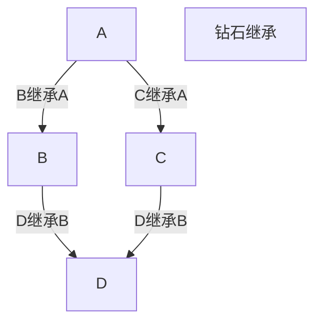
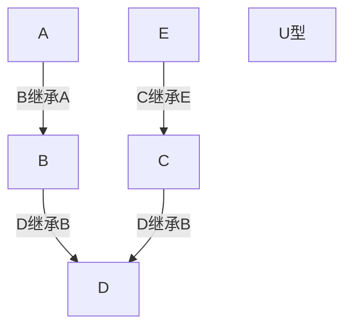
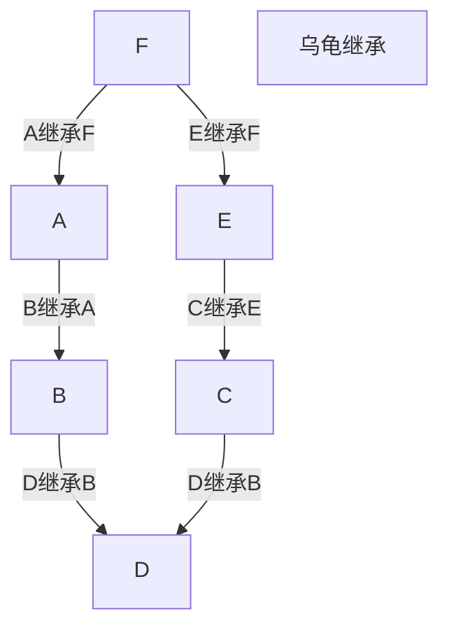

# Python中的继承和多继承以及多态

## 定义

- 继承：当我们定义一个class的时候，可以从某个现有的class继承，新的class称为子类（Subclass），而被继承的class称为基类、父类或超类（Base class、Super class），而这种形式就是继承。

```python
class fa:
    def __init__(self,n,d):
        self.name = n
        self.drink = d
    def d(self):
        print(" %s 正在喝 %s "%(self.name,self.drink))

class ss(fa):
    def __init__(self,n,d,l):
        fa.__init__(self,n,d)
        self.lu = l
    def d(self):
        print("%s 在 %s 喝 %s"%(self.name,self.lu,self.drink))

s = ss("儿子","牛奶","医院")
s.d() # 输出 儿子 在 医院 喝 牛奶
```

  - 多继承：当我们定义一个class的时候，可以从多个现有的class继承，新的class称为子类（Subclass），而被继承的class称为基类、父类或超类（Base class、Super class），而这种形式就是多继承。

```python
class fa:
    def __init__(self,n,d):
        self.name = n
        self.drink = d
    def d(self):
        print(" %s 正在喝 %s "%(self.name,self.drink))

class ss(fa):
    def __init__(self,n,d,l):
        fa.__init__(self,n,d)
        self.lu = l
    def d(self):
        print("%s 在 %s 喝 %s"%(self.name,self.lu,self.drink))

class pot:
    def __init__(self,n,dz):
        self.name = n
        self.dz = dz
    def d(self):
        print("我叫 %s，我正在 %s"%(self.name,self.dz))

class duot(pot,fa):
    def __init__(self,n,d,dz):
        fa.__init__(self,n,d)
        pot.__init__(self,n,dz)
    def dzzz(self):
      print("我叫 %s，我一边喝 %s 一边 %s"%(self.name,self.drink,self.dz))

d = duot("憨批","牛奶","打针")
d.dzzz() # 输出 我叫 憨批，我一边喝 牛奶 一边 打针
d.d() # 输出 我叫 憨批，我正在 打针
```
> 在继承中，若子类中的方法名和父类的方法名一样，则运行子类的方法，相反则看调用的方法名
>
> 在多继承中，若子类中的方法名和父类的方法名一样，则运行子类的方法，相反则看调用的方法名，若调用的方法和多个父类的方法名相同，则调用继承顺序靠前的父类的方法

- 多态：指一类事物有多种形态，比如动物类，可以有猫，狗，猪等等。（一个抽象类有多个子类，因而多态的概念依赖于继承）或者说是同一个行为具有多个不同表现形式或形态的能力。

  

```python
class Animal: #同一类事物:动物
    def run(self):
        print("Animal is runing……")

class Cat(Animal): #动物的形态之一:猫
    def talk(self):
        print('Cat say miaomiao')
class Dog(Animal): #动物的形态之二:狗
    def talk(self):
        print('Dog say wangwang')

class Pig(Animal): #动物的形态之三:猪
    def talk(self):
        print('Pig say aoao')
```
>说到多态，就要提到多态性
>
>多态性是指具有不同功能的函数可以使用相同的函数名，这样就可以用一个函数名调用不同内容 的函数。在面向对象方法中一般是这样表述多态性：向不同的对象发送同一条消息，不同的对象在接收时会产生不同的行为（即方法）。
>简单来说，就是**一个接口,多种实现**

```python
# 衔接上面
c = Cat()
d = Dog()
p = Pig()

def func(obj):
    obj.talk()
    
func(c) # 输出 Cat say miaomiao
func(d) # 输出 Dog say wangwang
func(p) # 输出 Pig say aoao
```

  - super()函数：super 是用来解决多重继承问题的，直接用类名调用父类方法在使用单继承的时候没问题，但是如果使用多继承，会涉及到查找顺序（MRO）、重复调用（钻石继承）等种种问题。

```python
super(class,self)
# 多继承
super(某个父类,实例) # 可以指定调用的是那个父类
super(子类,实例) # 和 实例.父类方法() 类似，按照顺序调用

# 继承
super(子类,实例) # 调用父类
```

```python
class fa:
    def __init__(self,n,d):
        self.name = n
        self.drink = d
    def d(self):
        print(" %s 正在喝 %s "%(self.name,self.drink))

class ss(fa):
    def __init__(self,n,d,l):
        fa.__init__(self,n,d)
        self.lu = l
    def d(self):
        print("%s 在 %s 喝 %s"%(self.name,self.lu,self.drink))
        
s = ss("儿子","牛奶","医院")
s.d() # 输出 儿子 在 医院 喝 牛奶
super(ss,s).d() # 输出 儿子 正在喝 牛奶
super(fa,s).d() # 报错 AttributeError 'super' object has no attribute 'd'

class pot:
    def __init__(self,n,dz):
        self.name = n
        self.dz = dz
    def d(self):
        print("我叫 %s，我正在 %s"%(self.name,self.dz))
class duot(pot,fa):
    def __init__(self,n,d,dz):
        fa.__init__(self,n,d)
        pot.__init__(self,n,dz)
    def dzzz(self):
        print("我叫 %s，我一边喝 %s 一边 %s"%(self.name,self.drink,self.dz))
        
d = duot("憨批","牛奶","打针")
d.dzzz() # 输出 我叫 憨批，我一边喝 牛奶 一边 打针
d.d() # 输出 我叫 憨批，我正在 打针
super(pot,d).d() # 输出 憨批 正在喝 牛奶
```

## 方法

### 继承：

```python
class DerivedClassName(BaseClassName1):
    <statement-1>
    .
    .
    .
    <statement-N>
# 例如
class Animal:
    def run(self):
        print('Animal is running...')
        
class Dog(Animal):
    pass
```

### 多态

```python
class DerivedClassName(BaseClassName1):
    <statement-1>
    .
    .
    .
    <statement-N>
class DerivedClassName(BaseClassName1):
    <statement-1>
    .
    .
    .
    <statement-N>
# 例如
class Animal:
    pass
        
class Dog(Animal):
    def run(self):
        print('Dog is running...')

class Cat(Animal):
    def run(self):
        print('Cat is running...')
```

### 多继承

```python
class DerivedClassName(Base1, Base2, Base3):
    <statement-1>
    .
    .
    .
    <statement-N>
# 例如
class Animal:
    def run(self):
        print('Animal is running...')
class Dog:
    def run(self):
        print('Dog is running...')
class Cat(Dog,Animal):
    pass
```

## 应用场景

### 继承

> 应用场景1
>
> 想要定义动物类，如猫、狗
>
> 但是，一个一个的写就太多了

```python
class Animal:
    def __init__(self,n):
        self.name = n
    def run(self):
        print('%s is running...'%self.name)
class Dog(Animal):
    def __init__(self,n):
        Animal.__init__(self,n)

class Cat(Animal):
    def __init__(self,n):
        Animal.__init__(self,n)
Dog = Dog("Dog")
Cat = Cat("Cat")
Dog.run()# 输出 Dog is running...
Cat.run()# 输出 Cat is running...
```

### 多态

> 应用场景1
>
> 他的徒弟们都进行了学习
>

```python
class a:
  pass

class td1(a):
    def study(self):
        print("降龙十八掌")

class td2(a):
    def study(self):
        print("降龙十巴掌")
        
class td3(a):
    def study(self):
        print("降龙巴巴掌")

s1 = td1()
s2 = td2()
s3 = td3()

def do(self): # 接口
    self.study()

do(s1) # 输出 降龙十八掌
do(s2) # 输出 降龙十巴掌
do(s3) # 输出 降龙巴巴掌
```
> 应用场景2
>
> 每个人都有不同的职业和技能

```python
class people:
    pass
class student(people):
      def can(self):
          print("学习")

class interpreter(people):
      def can(self):
          print("十八国语言")

s = student()
i = interpreter()

def c(obj):
    obj.can()

obj(s) # 输出 学习
obj(i) # 输出 十八国语言
```

### 多继承

> 应用场景1
  >
> 爷爷有一种超能力，奶奶也有一种超能力
  >
  > 爸爸想两个超能力都继承下来

```python
class gf:
def run(self):
      print("可以一秒跑400km")
class gm:
  def fly(self):
      print("可以一秒飞400km")
class fa(gf,gm):
  def non(self):
      print("正在学习超能力")
f = fa()
f.non()# 输出 正在学习超能力
f.run() # 输出 可以一秒跑400km
f.fly() # 输出 可以一秒飞400km
```

- Python 子类继承父类构造函数说明

  - 子类不重写\__init__(即没有def  \_\_init\_\_(self)),实例化子类时，会自动调用父类定义的 \_\_init\_\_。

  ```python
  class a:
      def __init__(self,n):
          self.name = n
      def run(self):
          print("%s 正在跑"%self.name)
  
  class b(a):
      def run(self):
          print("%s 正在走"%self.name)
  
  ba = b("A")
  ba.run() # 输出 A 正在走
  super(b,ba).run() # 输出 A 正在跑
  ```
  
- 否则，就不会自动调用父类定义的 \_\_init\_\_
  
  - 如果重写了\__init__时，要继承父类的构造方法，可以使用 super 关键字：
  
    ```python
    super(子类，self).__init__(参数1，参数2，....)
    ```
  
    还有一种经典写法：
  
    ```python
     父类名称.__init__(self,参数1，参数2，...)
    ```
    
      ```python
    class a:
        def __init__(self,n):
            self.name = n
        def run(self):
            print("%s 正在跑"%self.name)
    
    class b(a):
        gl = 0
        def __init__(self,n,g):
            super().__init__(n) # Super1 这多继承中，这个super()指的是第一个父类
            super(b,self).__init__(n) # Super2 这个上面的等同
            a.__init__(self,n) # 经典写法
            self.gl = g
        def run(self):
            print("%s 走了%d 公里"%(self.name,self.gl))
    
    ba = b("A",90)
    ba.run() # 输出 A 走了90 公里
    super(b,ba).run() # 输出 A 正在跑
      ```
    
  
### 多态的应用场景

  1. 对象所属的类之间没有继承关系
  
     > 调用同一个函数fly(), 传入不同的参数（对象），可以达成不同的功能
  
     ```python
     class Duck(object):                                  # 鸭子类
         def fly(self):
             print("鸭子沿着地面飞起来了")
     
     class Swan(object):                                  # 天鹅类
         def fly(self):
             print("天鹅在空中翱翔")
     
     class Plane(object):                                 # 飞机类
         def fly(self):
             print("飞机隆隆地起飞了")
     
     def fly(obj):                                        # 实现飞的功能函数
         obj.fly()
     
     duck = Duck()
     fly(duck)
     
     swan = Swan()
     fly(swan)
     
     plane = Plane()
     fly(plane)
     
     ===运行结果：=======
     鸭子沿着地面飞起来了
     天鹅在空中翱翔
     飞机隆隆地起飞了
     ```
  
  2. 对象所属的类之间有继承关系（应用更广）

> “是”的关系，类如 小明是人 ==> 小米类和人类为继承关系
>
> “有”的关系，类如 老师有生日 ==> 老师类和生日类为组合关系

## 补充-继承

### Python3中的继承

> Python3继承顺序遵循的是广度优先算法(从左向右查找，和经典类的区别是最后找所有分支共同的父类)

> 钻石继承



```python
class A:
    def h(self):print('a')
class B(A):
    def h(self):print('b')
class C(A):
    def h(self):print('c')
class D(B,C):
    def h(self):print('d')
d = D()
d.h()
```

| A    | B(A) | C(A) | D(C,B) | 输出 |
| ---- | ---- | ---- | ------ | ---- |
| 有   | 有   | 有   | 有     | D    |
| 有   | 有   | 有   | 无     | C    |
| 有   | 有   | 无   | 无     | B    |
| 有   | 无   | 无   | 无     | A    |

>U型继承



> 继承顺序：B-->A-->C-->E



> 继承顺序：B-->A-->C--->E-->F

>可以通过`mro()`来实现查看继承顺序

```python
class A:
    def h(self):print('a')
class B(A):
    def h(self):
        super().h()
        print('b')
class C(A):
    def h(self):
        super().h()
        print('c')
class D(B,C):
    def h(self):
        super().h()
        print('d')
d = D()
d.h()
```

> 打印顺序：A-->C-->B-->D
>
> super的本质：不是单纯找父类，而是根据调用者的节点位置的广度优先顺序来的

### Python2中的继承

> 继承顺序遵循的是深度优先算法(从左向右查找，一条分支找到底，若果没找到就去另一条分支继续找)


> 继承顺序：B-->A-->F--->C-->E

### [接口类以及抽象类](C:\Users\Alex\Desktop\学习\python 继承 -接口类&&抽象类.md)

> Python崇尚鸭子类型，不崇尚使用继承的形式去规范代码

## 补充-多态

> 多态的含义：指一类事物有多种形态
>
> 多个对象执行同样的方法实现不同的结果，这就是多态性
>
> Python动态强类型的语言 ===> 对数据类型敏感也对数据类型不敏感
>
> 强类型的语言：对数据类型敏感
>
> 弱类型的语言：对数据类型不敏感

### 鸭子类型

> 当看到一只鸟走起来像鸭子、游泳起来像鸭子、叫起来也像鸭子，那么这只鸟就可以被称为鸭子
>
> 我们并不关心对象是什么类型，到底是不是鸭子，只关心行为

## 补充-封装

> 广义上面向对象的封装：代码保护，面向对象的思想本身就是一种封装
> 只让自己的对象能够调用自己类的方法
>
> 狭义上封装：面向对象的三大特性之一
> 属性 和 方法都藏起来 不让你看  ====>>>>  就是在广义的基础上，添加私有属性、私有方法(属性、方法前面加__)

### 使用私有的场景

> 1. 隐藏起一个属性，不想让类的外部调用
> 2. 我想保护这个属性，不想让属性随意被改变
> 3. 我想保护这个属性，不想子类继续

## 面向对象常用术语

**抽象/实现**

抽象指对现实世界问题和实体的本质表现,行为和特征建模,建立一个相关的子集,可以用于 绘程序结构,从而实现这种模型。抽象不仅包括这种模型的数据属性,还定义了这些数据的接口。

对某种抽象的实现就是对此数据及与之相关接口的现实化(realization)。现实化这个过程对于客户 程序应当是透明而且无关的。 

**封装/接口**

封装描述了对数据/信息进行隐藏的观念,它对数据属性提供接口和访问函数。通过任何客户端直接对数据的访问,无视接口,与封装性都是背道而驰的,除非程序员允许这些操作。作为实现的 一部分,客户端根本就不需要知道在封装之后,数据属性是如何组织的。在Python中,所有的类属性都是公开的,但名字可能被“混淆”了,以阻止未经授权的访问,但仅此而已,再没有其他预防措施了。这就需要在设计时,对数据提供相应的接口,以免客户程序通过不规范的操作来存取封装的数据属性。

注意：封装绝不是等于“把不想让别人看到、以后可能修改的东西用private隐藏起来”

**真正的封装是，经过深入的思考，做出良好的抽象，给出“完整且最小”的接口，并使得内部细节可以对外透明**

**（注意：对外透明**的意思是**，**外部调用者可以顺利的得到自己想要的任何功能，**完全意识不到内部细节的存在）**

**合成**

合成扩充了对类的 述,使得多个不同的类合成为一个大的类,来解决现实问题。合成 述了 一个异常复杂的系统,比如一个类由其它类组成,更小的组件也可能是其它的类,数据属性及行为, 所有这些合在一起,彼此是“有一个”的关系。

**派生/继承/继承结构**

派生描述了子类衍生出新的特性,新类保留已存类类型中所有需要的数据和行为,但允许修改或者其它的自定义操作,都不会修改原类的定义。
继承描述了子类属性从祖先类继承这样一种方式
继承结构表示多“代”派生,可以述成一个“族谱”,连续的子类,与祖先类都有关系。

**泛化/特化**

基于继承
泛化表示所有子类与其父类及祖先类有一样的特点。
特化描述所有子类的自定义,也就是,什么属性让它与其祖先类不同。

**多态与多态性**

多态指的是同一种事物的多种状态：水这种事物有多种不同的状态：冰，水蒸气

多态性的概念指出了对象如何通过他们共同的属性和动作来操作及访问,而不需考虑他们具体的类。

冰，水蒸气，都继承于水，它们都有一个同名的方法就是变成云，但是冰.变云(),与水蒸气.变云()是截然不同的过程，虽然调用的方法都一样

**自省/反射**

自省也称作反射，这个性质展示了某对象是如何在运行期取得自身信息的。如果传一个对象给你,你可以查出它有什么能力,这是一项强大的特性。如果Python不支持某种形式的自省功能,dir和type内建函数,将很难正常工作。还有那些特殊属性,像__dict__,__name__及__doc__